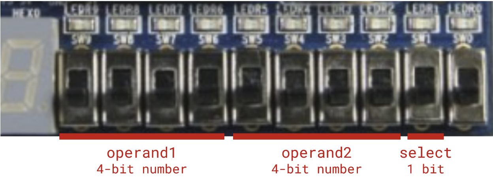
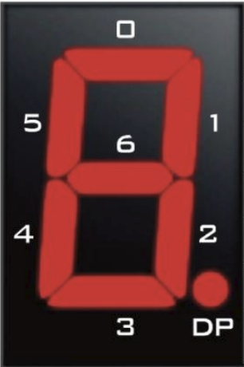

# Lab 1

### Cooking Math

- [0 Your First Module](#0-your-first-module)
  - [0.1 The Top Level](#01-the-top-level)
  - [0.2 The Testbench](#02-the-testbench)
  - [0.3 Pin Planning](#03-pin-planning)
- [1 Is That ALU Can Say?](#1-is-that-alu-can-say)
  - [1.1 The (mini) ALU](#11-the-mini-alu)
  - [1.2 The Testbench (again)](#12-the-testbench-again)
- [2 'Twas Segment to Be](#2-twas-segment-to-be)
  - [2.1 The Seven-Segment Digit](#21-the-seven-segment-digit)
  - [2.2 The Seven-Segment Display](#22-the-seven-segment-display)

## Introduction

Welcome to DAV! By this point, you’ve probably attended or watched the first lecture where we talked about the project and gave a high-level conceptual overview of logic design. Now, it’s time to try your hand at Verilog for the first time by making a (very) basic calculator on your FPGA. In the digital world, we refer to such circuits as “arithmetic logic units,” or ALUs.

## Resources and Reference Material

[Link to Lecture 1](https://drive.google.com/file/d/16LD_dYyo49NGHnih-ArGze99MuCCs8L4/view?usp=share_link)

[Link to Workshop 1](https://drive.google.com/file/d/12Pz_-xRepHj60k03G1PzrEOOhTwyxwga/view?usp=drive_link)

[Pin Sheet](https://docs.google.com/spreadsheets/d/1jTgphR61ozrNZlr9dLvId5t3o0FrikxSZWwAvhXF0Yo/edit#gid=0)

[Verilog Docs and FAQ](https://docs.google.com/document/d/1_8ruatZIb3sZb-3Kk3WOYC8Jzv4HvdwrTPZUGVupdVE/edit)

## Contact Us

You can contact the DAV leads on Discord.

**Claire Huang** (Discord: _zhiyujia_)  
**Premkumar Giridhar** (Discord: _8bitrobot_)

## 0 Your First Module

Your first module for the FPGA calculator will be a very basic top-level module. As we go on, we’ll add things to this module, but for now your task is to control the LEDs with the switches in a very specific way: each switch will light up the LED directly above it.

**Section 0** of this lab will be completed **live during the workshop** and the code will be made available. However, if you can’t make it or you want to try it yourself, you’ll have access to a recording that you can use to work through the lab. There will be **no checkoffs** for this section of the lab; however, you’ll still need to show us your working LEDs, so make sure you get it done! This part of the lab is by no means difficult; it’s simply an opportunity to become more familiar with Quartus.

### 0.1 The Top Level

Firstly, **create a new project** – instructions are in the workshop slides. Then, **create a file** named `miniALU_top.sv`.

Inside, you need to define the module and its ports – the syntax is provided in the Verilog docs linked at the top of the spec. We want our FPGA to process the **switches as inputs** and produce **outputs on the LEDs**. There are 10 switches and 10 LEDs, each representing a single binary value (up or down, on or off). Think about what ports you need to define to allow the module to use them. (If you feel like you need to define 20 individual ports, rest assured that it’s unnecessary. There’s a better way to consolidate those ports together!)

Finally, now that you have your ports, you need to somehow “connect” the switches to the LEDs. There’s a **single Verilog statement** you can use for connecting wires in the manner described above – if you can’t figure it out, refer to our docs!

That’s all there is to it! This module should be at most 10 lines long. Next, you’ll determine whether it actually works.

### 0.2 The Testbench

That’s right, it’s time for everyone’s favorite part of digital design: testbenching! Let’s write a testbench that confirms that our switch input gets mapped correctly to our LED output. Create a file named `miniALU_tb.sv` and set it as the top-level module.

A testbench, like any other module, uses the `module/endmodule` syntax for declaration. However, as the first line of any testbench, you must include the following line:
```verilog
timescale 1ns/1ns
```

This is a directive that QuestaSim, our simulation software, uses to determine the duration of “simulation time” units relative to “delay time” units, as well as a degree of precision. The details aren’t too important right now, so you can just copy-paste as written above. If you’re curious and want to read more, [click here](https://www.chipverify.com/verilog/verilog-timescale).

**Define a module** named `miniALU_tb` that has **no input ports** and whose **outputs are the LEDs**. (Like before, you don’t need 10 ports for this.) You’ll need to create a `reg` for your simulated switches. Inside the module, instantiate `miniALU_top` and pass in your switches and LED output port accordingly.

Remember that testbenches are less like digital circuit modules and more like simple scripts. Verilog code inside the `initial` block runs **sequentially **and the timing is determined by your use of delays. The workshop will go into more detail about what exactly this means and how to use these delays and the `initial` block to write a testbench. Though you don’t need to submit anything here for checkoffs, you’ll be writing your own testbench later on, so ask us questions if you don’t understand it!

### 0.3 Pin Planning

Now that you’ve verified your design in simulation, it’s time to upload it to the FPGA and see if it really works. Set `miniALU_top.sv` as the top level and run Synthesis again.

Now, open the Pin Planner. It should list your top-level I/O ports at the bottom below a large grid of colors and shapes. Ignore the grid and refer to the [Pin Sheet]([Pin Sheet](https://docs.google.com/spreadsheets/d/1jTgphR61ozrNZlr9dLvId5t3o0FrikxSZWwAvhXF0Yo/edit#gid=0)) to map your pins. More detailed instructions are provided in the workshop.

Once you’ve done that, run the Fitter and Assembler, then program your FPGA. If all is well, each switch should be able to control the LED above it!

## 1 Is That ALU Can Say?

This section of the lab will teach you how to implement the core module that will perform the calculations: **the Arithmetic Logic Unit, or ALU**.

### 1.1 The (mini) ALU

In this module, you’ll implement a very **basic ALU **that performs two operations. It will take two **4-bit numbers** and a **select line as input** and produce a single **20-bit number as output**.

Your ALU will **use the switches** as indicated below:



The select switch will dictate whether the ALU operation is an **addition** (i.e. when `select` is HIGH, output **operand1 + operand2**) or a left-shift (when `select` is LOW, output **operand1 << operand2**). There’s a commonly used hardware block (and a related Verilog construct) that allows you to select between two or more values based on a boolean condition; do you remember what it is? (Hint: It was mentioned in the lecture!)

The file `miniALU.sv` contains skeleton code including a module declaration and an empty `always_comb` construct, which we use to describe a combinational circuit.. Your task is to declare the module’s ports and fill out the `always` block to complete the module.

### 1.2 The Testbench (again)

I hope you didn’t think we’d let you get away without writing a testbench! Here, we’ll modify our testbench from earlier to test our ALU module. Consider the following:

- You will have more regs in this testbench because the module being tested takes in more inputs.
- It won’t suffice to simply test a couple cases – after all, your ALU has two modes and many more combinations of operands. You could code in tons of cases manually, but there’s an easier way: the Verilog `for`-loop!

```verilog
for (integer i = 0; i < 16; i = i + 1) begin
    #5; // simulation delay
    /* YOUR CODE HERE */
end
```

Consider using this as a template to write a for-loop that iterates through a large set of test-cases.

## 2 ‘Twas Segment to Be

In this part of the lab, you will implement a seven-segment decoder. In other words, your module will take as **input a 20-bit number** and produce as **output a set of 8-bit numbers** indicating the values of each segment of each digit. We’ll break this task down into two modules.

### 2.1 The Seven-Segment Digit

Each digit of the seven-segment display of the FPGA requires 8 bits to drive: 7 bits for the segments and an additional bit for the decimal point. This module, which we’ll call `sevenSegDigit`, accepts a **4-bit number** and a **1-bit on/off switch as input** and **output an 8-bit number** for the segments.



The segments in each digit are represented by the picture shown here. In other words, “bit 0” (i.e. the LSB) in your 8-bit number should represent the top segment, bit 1 should represent the top-right, etc. Pay careful attention to your indexing when you assign to these segments.

Also note that the segments are active-low, meaning that a value of **1 will turn the segment off** and **0 will turn it on**. This is a very common source of errors!

This module’s logic is simple: there are 10 digits, each one mapping to a distinct set of segments. Therefore, you can use a construct called a **`case`-statement** that looks like the `switch-case` statement you might have seen in other programming languages. Your case statement will compare the input to each of the 10 digits and produce a “default” output if none of them match – **this is required**.

Since we’re no longer working with simple operations or `assign` statements, you will need an `always` construct to contain your combinational logic. The skeleton code in `sevenSegDigit.sv` contains an `always` construct and some `case`-statement syntax. Your task now is to **complete this module** by adding a module declaration, port list, and finished `case`-statement. When finished, it should correctly output the seven-segment bits for any input number from 0 to 9. If the on/off switch is off, all of the segments should be unlit.

### 2.2 The Seven-Segment Display

Of course, one digit alone doesn’t accomplish very much because most numbers are more than one digit. Therefore, we will now write a module that **decodes a much larger 20-bit number** into 6 sets of segments. As before, a skeleton file has been provided – `sevenSegDisplay.sv`.

The logic for this module is simple because you’ve already written the decoder for one individual digit. You don’t have to write that logic again; you can simply instantiate a few copies of that module to decode each of the 6 digits in the number.

That being said, your focus for this module is implementing a **circuit that converts a 20-bit number into six 4-bit numbers**, one for each digit. Then, you should use `sevenSegDigit` to convert these 4-bit numbers into the **8-bit segment arrays**; **these will be your outputs**. How might you do this? Think about the arithmetic operators you have available to you in Verilog and which ones are useful for extracting digits from a number.

Finally, you need to instantiate this module in `miniALU_top` and wire up the ports as follows:

- The first operand input to the mini ALU is the first 4 switches (as labeled in the image from earlier).
- The second operand input to the mini ALU is the second 4 switches (as labeled in the image from earlier).
- The “mode” select input to the mini ALU is the ninth switch (as labeled in the image from earlier).
- The 20-bit number input to the seven-segment display module is the output of the mini ALU.
- The on/off switch input to the seven-segment display is the 10th (unused) switch on the FPGA.
- The output of the seven-segment display module is the output of the top level module (which gets mapped to the segmented display on the FPGA).

This will also require you to pin-plan! When it’s all done, you should be able to use the switches to display your calculation results on the FPGA. **Don’t delete your earlier LED code when doing this!** Your modules are allowed to have more than one output.

The end result will be your FPGA displaying the switches’ values on the LEDs and the mathematical result on the seven-segment display. Changing the switches should immediately change the displayed number, as should toggling the 9th switch to change the mathematical operation; and toggling that very last switch should turn the display on or off.
