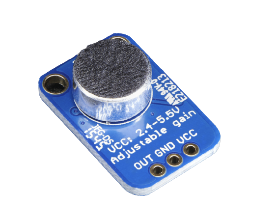
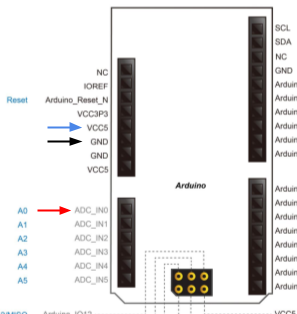

# Lab 5

### A Phone Named Michael

- [0: In DAV No One Can Hear You Scream](#0-in-dav-no-one-can-hear-you-scream)
- [1: Anyways, Don't Cry](#1-anyways-dont-cry)
- [2: It's So Sample](#2-its-so-sample)

## Introduction

This lab, well, is not really a lab. It’s a guided walkthrough of how your microphones work and how to connect them to your FPGA. You will find this useful when building the final Digital Audio Visualizer.

## Resources and Reference Material

[Pin Sheet](https://docs.google.com/spreadsheets/d/1jTgphR61ozrNZlr9dLvId5t3o0FrikxSZWwAvhXF0Yo/edit#gid=0)

[Solution](https://github.com/amidthestars/DAV-Outreach-Module-Solutions)

## Contact Us

You can contact the DAV leads on Discord.

**Claire Huang** (Discord: _zhiyujia_)  
**Premkumar Giridhar** (Discord: _8bitrobot_)

## 0 In DAV No One Can Hear You Scream

For DAV, we’ll be working with mics that look like this one below. This is an analog microphone. It has two input pins, VCC and GND, and an output pin through which it spits out an _analog_ voltage corresponding to the mic input intensity (a.k.a. the volume). If you want to know more about how microphones work, consult [this article](https://mynewmicrophone.com/how-do-microphones-work-a-helpful-illustrated-guide/) (and perhaps ChatGPT for a summary).

But wait! You might be thinking, _aren’t we learning about digital design?_ You’d be correct. To use the _analog_ microphone, you’ll need to use something called an analog-digital converter (ADC). This comes with its own problems, such as introducing slight noise, but analog microphones are generally more faithful to the original signal – there’s no extra noise from digitizing the signal – and they have fewer pins to deal with compared to digital microphones.

So anyways, onto the ADC we go!

## 1 Anyways, Don’t Cry

In order to use the ADC on our FPGAS, we can just use an IP! It’s called the **ADC Controller for DE-series Boards**.

In the IP settings, you’ll want to specify these:

- DE-Series Board: **DE10-Lite**
- ADC Clock Frequency: **10.0 MHz** (this should be filled in already)
- Number of channels: **1**
- System Clock Frequency: **50**

The files will be generated for you, and they’re all you need to get started with your ADC. However, you need to manually add the `.qip` file to your project - and after that, you can find the template within the QIP with the same name as your ADC instantiation. The ADC comes with eight channels, but we’ll only be using one of them (CH0).

To set up your microphone, you’ll want to use your breadboard. (If you need a refresher on how to use breadboards, [it’s covered in Lab 2](https://docs.google.com/document/d/1emXJVqnejqBGhXFgjVql8LgWDyoD7YptCEizWkGXgB4/edit#heading=h.i2sfhlfk4hwj).)

Then, you’ll want to wire up the VCC pin on the microphone to **VCC5** (the 5-volt power pin) on the board, the GND pin on the microphone to **GND**, and the OUT pin to **ADC_IN0**. Note that the little labels on the board are _incorrect_ for some pins, so you should use the screenshot above as your source of where the pins are.

## 2 It’s So Sample

To get a feel for how your microphone works, let’s test the waters a little bit! Your job is to get the output of your microphone onto the LEDs of your board. The ADC wants a clock (to sample) and a reset button, and it will output the microphone intensity to `CH0`. Then, display the magnitude on your LEDs. You can do that by using the output of the ADC outstream to right-shift `10'b1000000000` by some amount; due to sign-extension, this will cause light up more LEDs when the mic input is louder! (If the magnitude of the mic output is too large, all of the LEDs will always be lit up, so you may want to scale and/or shift your ADC output value by some experimentally derived constant.)

That’s it! Congratulations, you now have a working microphone. Soon, you’ll be putting the pieces of the puzzle together to make your final DAV -- coming soon :-)
