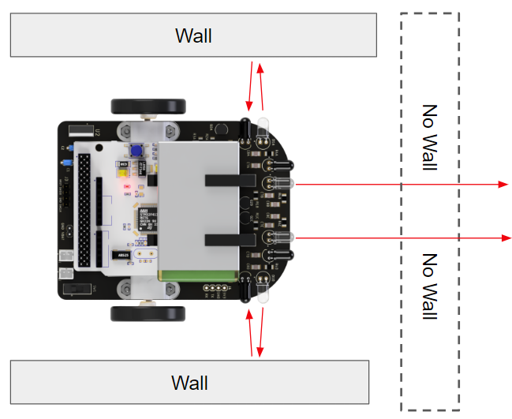
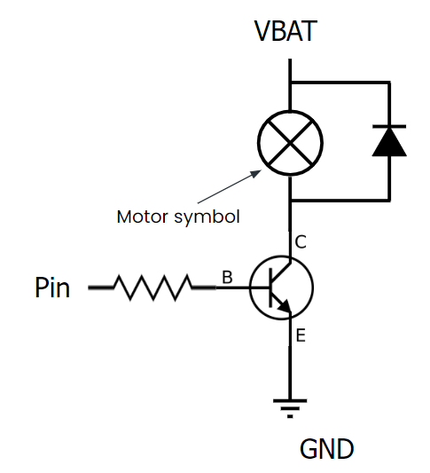
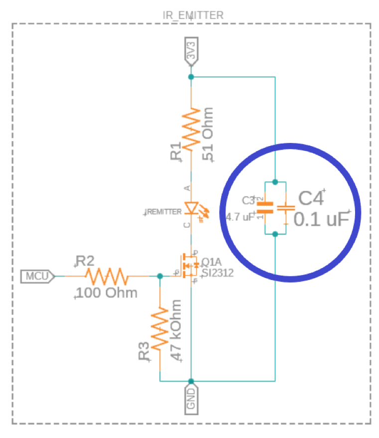
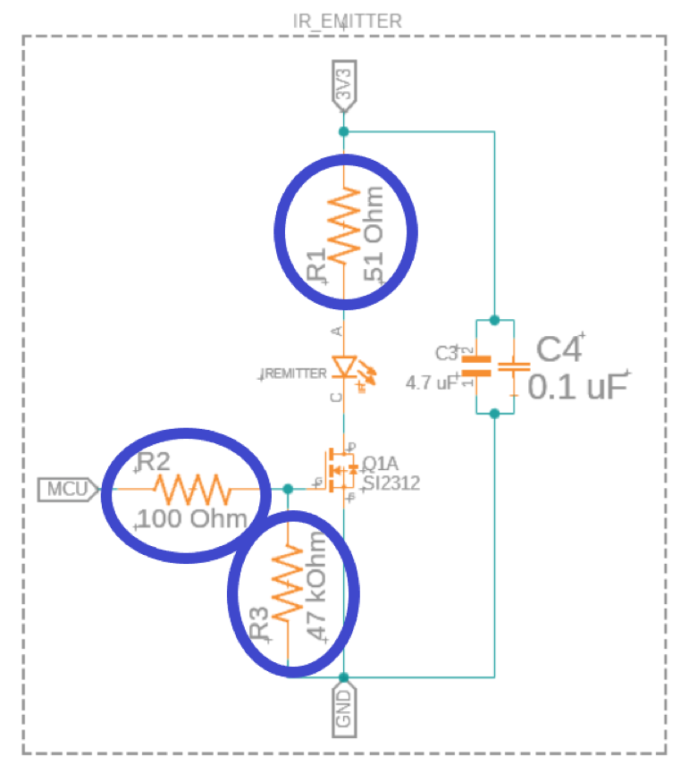
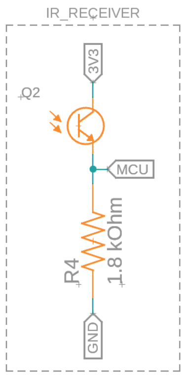

# Module 3
### IR Sensors Module

## Overview

1. [How IR sensors work](#how-ir-sensors-work)
2. [IR Emitter circuit breakdown](#ir-emitter-circuit-breakdown)
3. [IR Receiver circuit breakdown](#ir-receiver-circuit-breakdown)

In this module, you will learn about how the mouse sees the walls around it with the use of IR sensors! By the end of this module, you will know how IR sensors work, why we use them in micromouse, and know how each part of the IR schematic works and be able to model your own in Fusion 360.

As with the previous modules, if you would prefer to watch a lecture video instead of going through the module, you can do so with the following video and skip to the [IR Emitter circuit breakdown](#how-ir-sensors-work):

[Micromouse 2022 Lecture 4: IR Sensors](https://youtu.be/3N5E1Ai-aI8?list=PLAWsHzw_h0iiPIaGyXAr44G0XfHfyjOe7)

## How IR sensors work

The basic principle behind IR sensors is straightforward. An IR sensor consists of an IR emitter which is a specialized LED that emits IR light; and an IR receiver which is a phototransistor that can detect IR light. When the IR emitter is turned on & off, the IR light it produces bounce off the surroundings and into the phototransistor, which produces different values based on how far away the object the light bounced off of is.

The closer the object is to the receiver, the higher the number it reads, and the more voltage it passes through to the mcu. You can then interpret the voltage the mcu is reading as a distance.

In micromouse, IR sensors can be used to measure the presence of walls around the mouse! If there is a wall closeby, the IR sensors will read a relatively high value, and no walls will lead to a lower reading! 

Pros & Cons of using IR sensors (good to keep in mind as you’re designing your mouse):

1. Pros: 
    1. Easy to implement: IR sensors require relatively few components and are straightforward to use in the software as well.
    2. IR sensors don’t have to have contact with the walls to work (unlike limit switches)
    3. They output an analog value which lets you roughly measure distance.
    4. NOTE: there is an alternative to IR sensors called sonar (or ultrasonic) sensors, which use sound waves to measure distance. While they are far more accurate than IR sensors when it comes to measuring distance, IR sensors are much easier to use when it comes to detecting the presence of an object (like a wall). Furthermore, IR sensors are a lot faster than ultrasonic sensors, which is useful in micromouse.
2. Cons:
    1. Affected by ambient light: although this isn’t usually a problem, if you’re testing in areas with large amounts of sunlight the IR sensors simply won’t work because they will constantly measure the maximum value.
    2. Require calibration: you will need to recalibrate your IR thresholds every time you change your environment drastically as different rooms will lead to different readings due to slight variations in ambient light.
        - This is also true for different materials. Darker objects generally reflect less light.
    3. Variation between sensors: even if you have “identical” IR sensors, your sensors will not read the same values at the same distances, so calibration is essential.
    4. Non linear scaling of distances: the intensity of light measured by the IR receiver is proportional to 1/d2, meaning the IR readings don’t scale linearly with distance from the object/wall.

At first glance, it might seem that IR sensors are a massive disadvantage, but don’t be scared! Most of the disadvantages of IR sensors can be mitigated by calibrating your IR sensors (which we will discuss in a later module), and making sure you don’t test in direct sunlight!

## IR Emitter circuit breakdown

This is the full IR emitter circuit:

At first glance, it might look complicated, but we’ll break it down component by component.

The first thing to notice is the IR emitter itself. It has the symbol of a diode as the IR emitter is actually a specialized LED that emits IR light! 

* Emitter: [INL-5AMIR15](https://www.digikey.com/en/products/detail/inolux/INL-5AMIR15/10384755)
* Vforward = 1.3V
* Imax = 100mA
* 880 nm wavelength light
* 15° viewing angle

Another thing you might have noticed is that the IR emitter circuit as a whole looks similar to the circuit for controlling a motor with an MCU pin from the last module, except with an LED instead of a motor:

This isn’t a coincidence! The IR emitter can’t be powered directly from an mcu pin due to the current requirements of the LED, so it’s powered directly off of the 3.3V supply. It’s turned on and off with an mcu pin and a mosfet (serves the same purpose as a transistor) in the same way the motor is; if the mcu pin sends a voltage to the mosfet, it lets current flow through the LED, turning it on!

The specific mosfet we’re using is the N-channel Mosfet: [BS170](https://www.digikey.com/en/products/detail/BS170/BS170-ND/244280).

The next thing we’ll go over are C3 and C4, which are bypass capacitors: 

These serve a similar purpose as the decoupling capacitors from the power delivery schematic & the h-bridge schematic. The main difference is that these bypass capacitors help to provide a clean signal when dealing with DC whereas the decoupling capacitors help more when using AC (the PWM signal is AC).

Finally, let’s cover the various resistors throughout the circuit. R1 and R2 are both current limiting resistors. R1 limits the current through the IR LED, and R2 limits the current from the mcu to the mosfet.

R3 in this circuit is a pull-down resistor. It helps make sure that when the mcu isn’t sending a current to the mosfet, the mosfet is “pulled down” to ground; i.e. it stays off. It has a high resistance to keep its current draw from the mcu low.

That’s it for the IR emitter circuit! Now that you know what each part of the circuit does, go ahead and start making these in fusion 360 for your mice! Something that might help is to make one IR emitter circuit first and group it. This makes it easy to copy paste the circuit so you don’t have to make it 4 separate times for the 4 IR emitters! It will also help to name your MCU pins something recognizable for each emitter, like “IR_EMITTER_1” so you don’t accidentally short all of the pins together!

## IR Receiver circuit breakdown

The IR receiver circuit is a lot simpler than the IR emitter one:

This circuit has a phototransistor (Q2), and a resistor that creates a voltage divider for the MCU pin. If you remember from before, the phototransistor outputs an analog value based on how much light it receives. Since the IR emitter outputs 880 nm light, we want our phototransistor to be able to read this wavelength well, which is why we picked the [SFH 313 FA-¾](https://www.digikey.com/en/products/detail/osram-opto-semiconductors-inc/SFH-313-FA-3-4/1630112). Here are its specs:

* Reads best at 870 nm light, can read 740nm - 1080 nm
* 50mA max current (w/ 100mA max surge)
* 70V max collector-emitter voltage
* More IR light → More current passed through Q1

If Q2 reads more IR light, it lets a larger current pass through it. This means there will be a much larger voltage drop across R4, which is what we’re measuring through the mcu pin. 

That’s all for the IR emitter circuit! You can now go ahead and make it yourself in Fusion 360 for your mouse! Just like with the emitter, you need 4 receiver circuits, each with their own MCU pins. For now, just label them something that you can easily identify when you make the microcontroller schematic!
