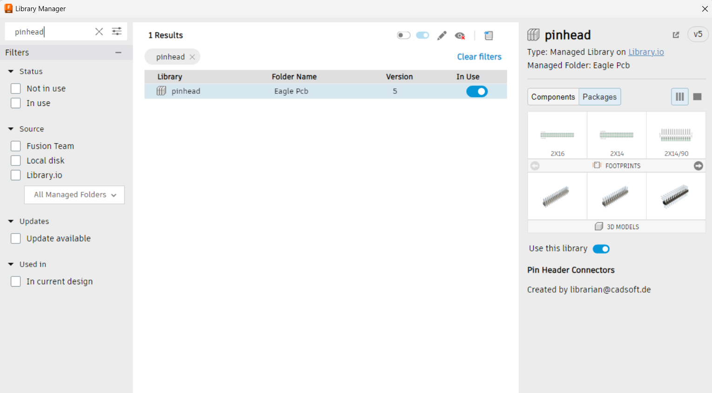
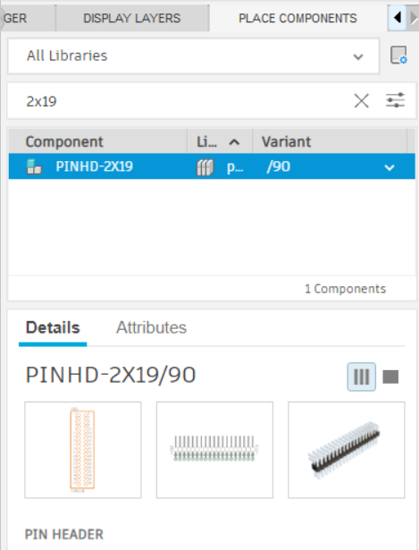
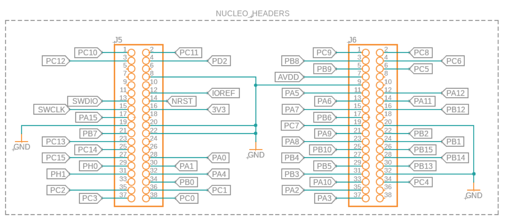
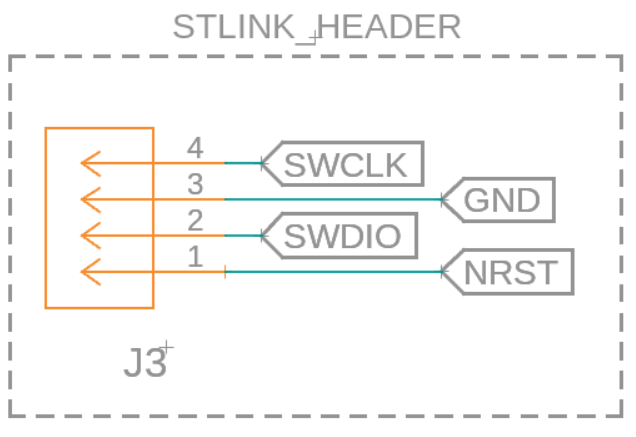
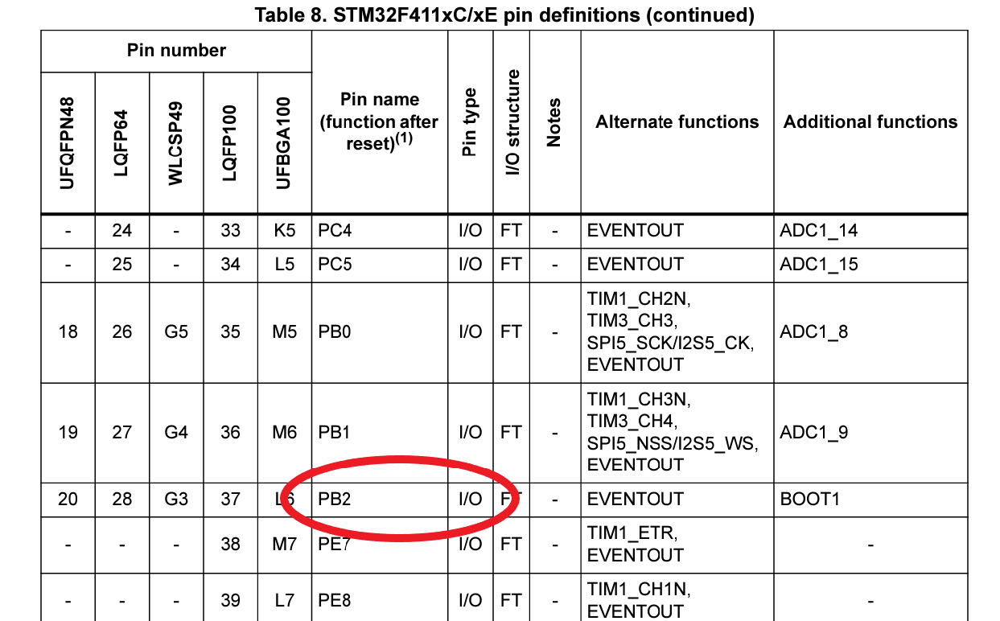
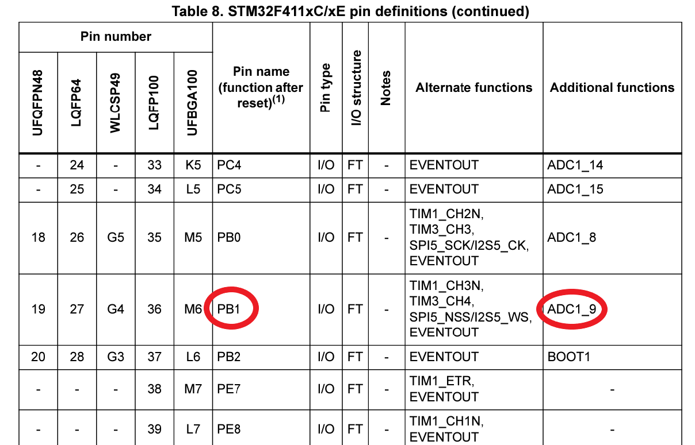

# Module 4
### Microcontroller Module

## Overview

1. [Microcontrollers](#microcontrollers)
2. [MCU Schematic](#mcu-schematic)
3. [Pin Selection](#pin-selection)

In this module, we’ll go over what microcontrollers are, the ones we’ll be using, and how the microcontroller interfaces with the rest of the schematic. There is no lecture video for this module, so please make sure you follow along with this module carefully and understand it!

## Microcontrollers

The microcontroller is the brain behind your mouse. It’s responsible for telling all of the other components what to do, and will run all of the algorithms needed to get your mouse to the center of the maze. 

Although there are many options for the mcu, we are going with the [Nucleo-F411](https://www.mouser.com/ProductDetail/STMicroelectronics/NUCLEO-F411RE?qs=Zt3UNFD9mQjdEJg18RwZ2g%3D%3D). An alternative to this board is the [Nucleo-F401](https://www.mouser.com/ProductDetail/STMicroelectronics/NUCLEO-F401RE?qs=fK8dlpkaUMvGeToFJ6rzdA%3D%3D), which is an older version of the F-411. Although older, it is virtually the same for the purpose of micromouse, and you can still follow along with this module. The pros of using a nucleo board are that they are very easy to use. All you need to do is pop them onto the headers (we will discuss this in the next section), and you’re good to go! The main con is that they are extremely big and will take up a lot of space on the pcb, and can interfere with other parts/breakout boards you may want to use.

Another option for microcontrollers are the stm32 pill boards, which are smaller than the nucleo boards and are still pretty easy to solder on. If you do use these, just make sure you’re using the correct connectors to your pcb!

If you are a bit more advanced and have experience with soldering, you could also use the smd versions of these microcontrollers. This will be just the mcu chip with no extra board. A great option is the [STM32F405RET7](https://www.digikey.com/en/products/detail/stmicroelectronics/STM32F205RET7/5268233). The main pro of using an smd microcontroller is that they take up very little space on the board, at the expense of a really hard PCB layout (we will discuss this in a later module, but tldr: you have to manually route all the connections yourself).

## MCU Schematic

Since we’re using the nucleo boards, our mcu schematic won’t include the microcontroller itself. Instead, it will include 2 2x19 headers which the nucleo board connects to. The library for these headers can be found in Fusion 360 if you open library manager, and enable the pinhead package:

Now you should be able to search up and use the 2x19 headers like usual:

The actual headers we will use are the [tall 2x19 headers](https://www.digikey.com/en/products/detail/sullins-connector-solutions/PPPC192LFBN-RC/810258). This way, you will have enough space under the nucleo boards for the motors. If you are using the nucleo boards, please use these headers or your motors will NOT fit!

The point of these headers is to be able to interface with the mcu pins easily. This also means that we have to give all of the header pins the correct labels so that we can use them. This is because the pins on the nucleo are already predetermined, and we need to make sure we have them right on the schematic. If you remember the power delivery schematic, we connected parts of it to labels PB6, PB7, PB8, and PB9. These are pins on the microcontroller which we will label in this section!

As a good exercise, you can go to the [nucleo’s pinouts](https://os.mbed.com/platforms/ST-Nucleo-F411RE/) and try to connect the headers properly yourself! We’ve included the finished product below so you can check (you can use GND labels, we’re using the grounds so it’s easier to see!):

If you want to know more about each pin’s functionality, you can check the [F-411 mcu’s datasheet](https://www.st.com/resource/en/datasheet/stm32f411ce.pdf). The pinouts start on page 38 of the pdf, and our mcu is the LQFP64 model. 

At this point, you might have noticed some weird labels on our nucleo header schematic, specifically the SWCLK, SWDIO, and NRST labels. These will be used to program and interface with the mouse when we start coding, and will utilize the st-link (which we’ll explain in the next module). For now, you just need to create a 4 pin header so you can connect your mouse to the st-link. You can use the 1x4 pin header in the fusion library by searching for pinhd-1x4:

Connect it to labels like this to create your programming header:

## Pin Selection

Now’s a great time to practice looking through the [datasheet](https://www.st.com/resource/en/datasheet/stm32f411ce.pdf) for the correct pins to connect the IR emitters and receivers to! Note that this is the datasheet for the STM32F411 chips (the nucleos use these), and you should reference your correct datasheet if you are using a different chip. If you remember, we had placeholder names for our IR schematic’s MCU pins, which we will properly define here. Looking for pins is pretty straightforward:

1. Figure out which functionality you need for the pin
2. Find a pin with the desired functionality in the datasheet (above)

For the emitters, we just want any pins capable of input/output. In the datasheet, this is denoted by the I/O pin type:

Make sure you find 4 different pins which aren’t used by the motors and rename the labels in the emitter schematics! The 4 that we’re going forward with (which will be used in the software modules later on) are PA7, PB2, PB13, and PC9. It doesn’t matter which emitter gets which pin; it’s not too important right now and can be changed in the software.

Finally, you want to pick pins for the IR receivers. The special functionality we’re looking for is the analog to digital converter, or ADC. It’s denoted by ADCx_y in the datasheet under Additional functions (the last column):

Just like with the emitters, make sure you find 4 different pins that aren’t used by the motors OR the emitters. The ones that will be referenced for the rest of the modules are PA6, PB1, PC4, and PC5. Again, make sure you rename the MCU labels on the receivers in the schematic!

Now that you know how to find pins and assign them in the schematic, feel free to add anything else you want to your mouse! You can look for breakout boards like a gyroscope or lcd display to make your mouse unique!