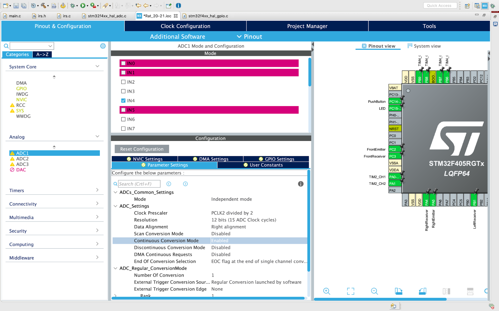
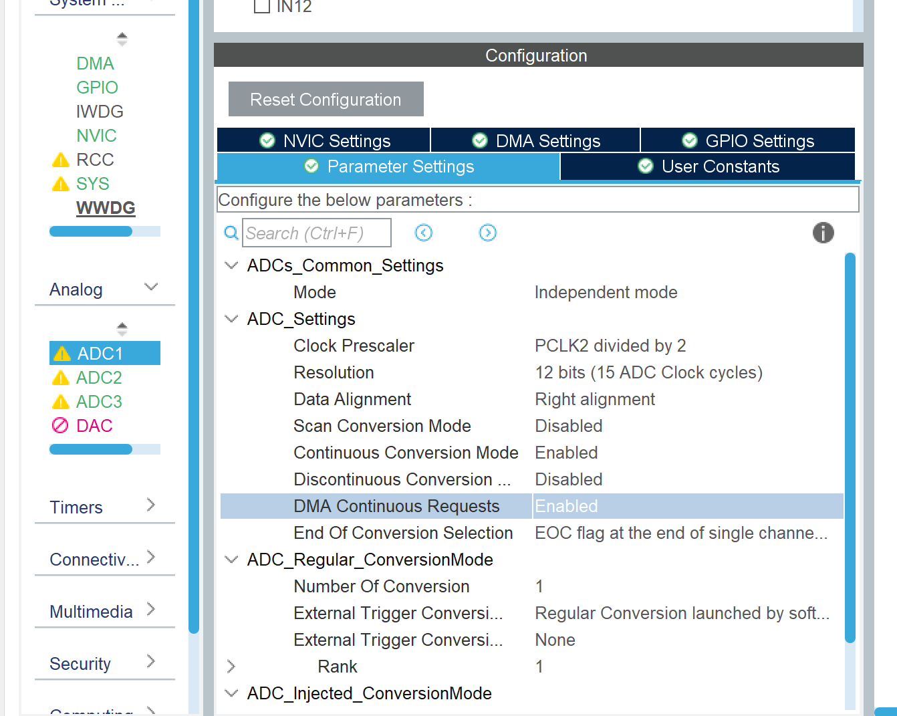
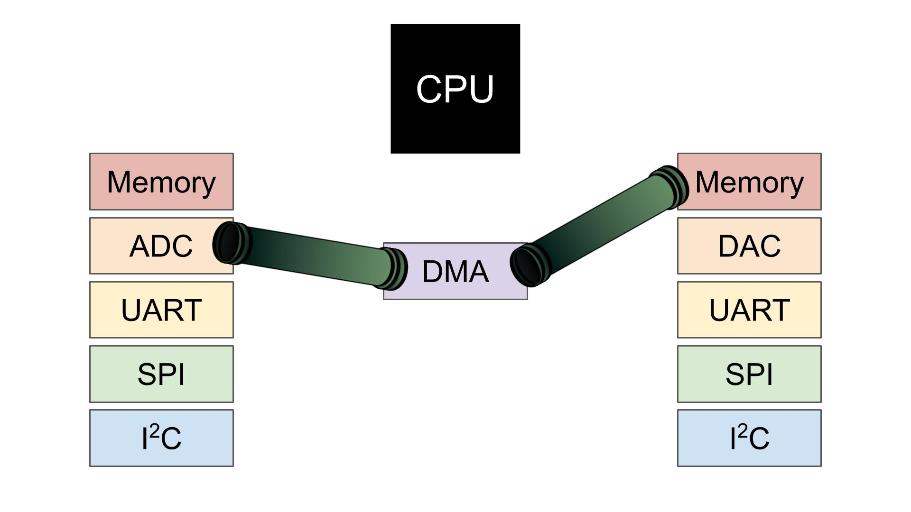

# Module 7
### IR Code Module

## Overview

1. [Hardware](#hardware)
2. [Software](#software)
    1. [Step 1: Configuring your pins in CubeIDE](#step-1-configuring-your-pins-in-cubeide)
    2. [Step 2: Write Code to read the IRs](#step-2-write-code-to-read-the-irs)
    3. [Step 3: Maze Navigation](#step-3-maze-navigation)

In this module, you will learn how to read IR sensors with your mouse, and create a basic maze solving algorithm! 

## Hardware

Before continuing with the rest of the module and using the IR sensors, we first need to solder them on. Make sure you have all of the emitters (diodes) and receivers (the phototransistors) soldered onto your mouse along with the passives that go with them (resistors and capacitors). You can refer to the schematic you’ve been making so far to check which passives you have to have soldered on before continuing (just make sure all the ones from all the IR schematics are on the board and soldered on). 

## Software

### Step 1: Configuring Your Pins in CubeIDE

Let’s set up the pins for the emitters and receivers in the .ioc file. Refer to the following table for how to set up each pin and the name to give it.

<table>
  <tr>
   <td>Pin
   </td>
   <td>Setting
   </td>
   <td>User Label
   </td>
  </tr>
  <tr>
   <td>PC5
   </td>
   <td>ADC1_IN15
   </td>
   <td>LeftReceiver
   </td>
  </tr>
  <tr>
   <td>PA6
   </td>
   <td>ADC1_IN6
   </td>
   <td>FrontLeftReceiver
   </td>
  </tr>
  <tr>
   <td>PB1
   </td>
   <td>ADC1_IN9
   </td>
   <td>FrontRightReceiver
   </td>
  </tr>
  <tr>
   <td>PC4
   </td>
   <td>ADC1_IN14
   </td>
   <td>RightReceiver
   </td>
  </tr>
  <tr>
   <td>PC9
   </td>
   <td>GPIO_OUTPUT
   </td>
   <td>LeftEmitter
   </td>
  </tr>
  <tr>
   <td>PA7
   </td>
   <td>GPIO_OUTPUT
   </td>
   <td>FrontLeftEmitter
   </td>
  </tr>
  <tr>
   <td>PB2
   </td>
   <td>GPIO_OUTPUT
   </td>
   <td>FrontRightEmitter
   </td>
  </tr>
  <tr>
   <td>PB13
   </td>
   <td>GPIO_OUTPUT
   </td>
   <td>RightEmitter
   </td>
  </tr>
</table>

Next, we have to configure the ADC input. We will be using an ADC (analog to digital converter) along with a DMA (direct memory access controller) to take multiple readings from the IR so we can average them.

Go to the “Analog” tab on the left and select “ADC1” and switch “Continuous Conversion Mode” to be enabled.

	

Now go to System Core → DMA → DMA2. Click “Add”, select “ADC1” as the DMA Request and set the Mode Circular.

Now go back to the ADC1 settings and enable “DMA Continuous Requests”

Click the generate code button.

Here’s an explanation of what we just did:

* Continuous conversion mode allows us to take several measurements continuously with the ADC, meaning we can take a bunch of readings from the IRs and then average them to get a more accurate reading.
* The DMA (that’s a direct memory access controller) takes the data from the ADC and sends it straight to memory. If we didn’t use the DMA, all the data would need to flow through the CPU and then to memory which would be a lot slower. Since we are just passing data and not doing anything with it for now, it doesn’t make a whole lot of sense to make the data go through the CPU.

    

* The DMA fills up a buffer in memory, which is an array of 16-bit integers (but more on that later). Setting the mode to circular will overwrite old values in that buffer once it is full, meaning that our readings will be continually updated until we tell the ADC to stop reading data.
* One perk of setting the mode to circular is that we can get notified once the data buffer is full. So later on, we will turn on the ADC and wait for this notification before processing the readings. 

### Step 2: Write Code to Read the IRs

As with the previous assignments, we’ve provided you with template files. Download them [here](https://drive.google.com/drive/folders/1DDPVE18BBsPl2pimrRnUL-z9BYxZVxpp?usp=sharing).

Outside the template files, there is one change we need to make in main.h and main.c so we can access the ADC in irs.h and irs.c (the template files provided to you)

Copy and paste the following function declarations in main.h in the USER CODE BEGIN/END EFP section

    ADC_HandleTypeDef* Get_HADC1_Ptr(void);

Now copy and paste the following function implementation in main.c in the USER CODE BEGIN/END 4 section (the same one we added the external interrupt code all the way back in Assignment 1A)

    ADC_HandleTypeDef* Get_HADC1_Ptr(void)
    {
        return &hadc1;
    }

These two bits of code provide a way for external code files (irs.c) to access the ADC by providing the location in the MCU’s memory at which the ADC is controlled (through what is called a pointer). We declare the function used to access this pointer in main.h, and then implement it in main.c.

We have supplied our own delay function since there is no embedded delay function for delays on the order of microseconds (the HAL_Delay() function is in milliseconds which is way too long for our purposes)

* `#include "delay.h"` in main.c because we need to initialize the delay function in the initialization section of main.c
* Call `Delay_Init()` in the `USER CODE INIT` section in the main function in main.c to initialize the delay functionality.
* Now once you `#include "delay.h"` in irs.c, you should be able to call the delay function to delay a specific number of microseconds.

Now go and fill in the missing code in irs.c! We provided you with the function to read data from the ADC since it is somewhat complicated, so what you need to do is take care of turning on and off the IR emitters and then reading the ADC input.

* Remember, we only want to have one IR emitter on at a time so we can avoid accidentally reading reflected light from a different receiver/emitter pair.

If you’re curious, here’s a short explanation of what the `analogRead()` function is doing:

1. Configure the ADC through the `sConfig` variable. We will pass this variable to the ADC when we start it so it knows which channel to read (among other things)
2. Denote which ADC channel to read (so we read the correct emitter)
    1. **NOTE:** In the code we provided, we assume all the emitters and receivers are connected to the MCU as we outlined above. If the pins are connected differently the `analogRead()` function we provided will not work properly.
3. Pass this configuration to the ADC and make sure everything is okay.
4. Start the ADC capture with the DMA to fill up the buffer. The buffer is defined at the top of irs.c as `uint16_t adc_buf[NUM_SAMPLES];`
5. The “complete” variable keeps track of whether the buffer is full. It is reset to be 0 before starting the ADC, and it is changed to 1 once the ADC buffer is full. We use this variable to remain idle in a while loop in the `analogRead() `function while the data acquisition is not yet complete.
    2. We are notified when the ADC buffer is full by the `HAL_ADC_ConvCpltCallback(ADC_HandleTypeDef* hadc) `function. This function is called once the ADC is full and inside of this function we stop the ADC and set the “complete” variable to 1.
6. Once the data acquisition is complete, take the average reading by summing all the values and dividing by the number of measurements.

### Step 3: Maze Navigation

Now it’s time to use your IR readings to control your Rat! In the future, we’ll use maze solving algorithms to figure out which direction to go, but for now we’re just going to go in whatever direction doesn’t have a wall. This method of navigation is known as “dead reckoning.”

Here’s the logic behind how we recommend controlling your rat:

* If there is no wall in front of you, go straight
* If there is a wall in front of you, but no wall to the right, turn right by 90 degrees
* Else, turn left
* Repeat

Using this logic in the body of the while loop in main.c should allow your Rat to make it through a path in the maze without hitting any walls.

For now, we’ll keep all this logic in the while loop in main.c. You already have all the pieces in place with the `move()` and `turn()` functions from the last assignment. So, moving straight and turning should be as simple as calling those functions.

Once you feel your Rat is ready, come to the lab and try out a small version of the real maze! Fow now, please don’t modify the existing maze, since the pieces are quite difficult to take apart and put together (much like the Nucleo and the headers!).

The one nuance with this is that you will need to determine a threshold for what constitutes a wall. Your IRs produce a value in the range of 0 to 4095 (although the range of values we see may be narrower than that), and you need to convert that to a boolean value to denote if there is a wall or not. You will have to determine this threshold experimentally since the exact readings from the IRs will vary based on the components you are using and the ambient lighting.

* Once you have this threshold value, just check if your IR reading is above or below the threshold, and then move your Rat accordingly.

Once you have this working, congratulations! Take a moment to soak in what you’ve accomplished: you have created a robot that can autonomously navigate through an unknown path using infrared sensors and precise PID control. You have programmed a MCU using a very complicated IDE that is incredibly complex compared to simpler IDEs like the Arduino software. This is no small feat and you should feel very proud!