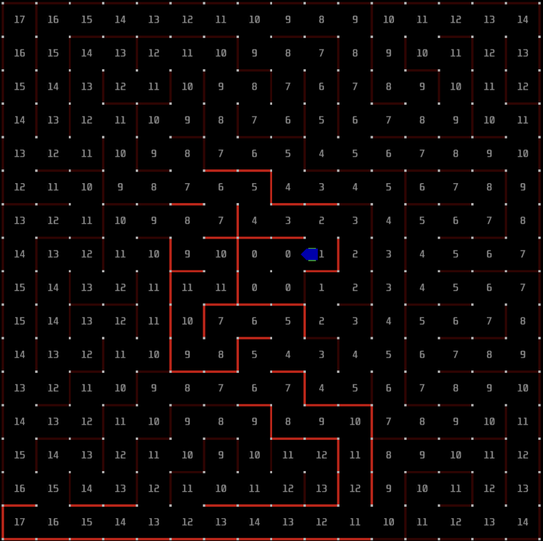

# Module 8
### Floodfill Module

## Overview

1. [Floodfill Lecture](#heading=h.69qwjk4w5wc4)
2. [Simulation Setup](#heading=h.2suvr82y3f4z)
3. [Implementing Floodfill](#heading=h.1vr7qet6ko0l)
4. [Implementation Tips](#heading=h.1zmi9tmv6nd5)

In this software filled lecture, we will walk you through the floodfill maze solving algorithm. Please make sure you really understand how this algorithm works, as you will be creating your own later in the module. With this final step, your mouse should be good to compete in a micromouse competition!

# Floodfill Lecture

So far, you have created your mouse schematic, created your mouse, got the motors to move, and implemented the IR sensors. You’ve come a long way! Congratulations! Your mouse is almost complete. The last thing needed to get your mouse to actually solve the maze is coding the algorithm that will help your mouse navigate through the 16x16 maze during a competition. You will do so by implementing the floodfill algorithm for your mouse. 

Before continuing on with the rest of this module, please make sure you watch the floodfill lecture below. This will give you a good conceptual understanding of the algorithm and will help you immensely while creating your code.

# Simulation Setup

It would be incredibly impractical to try coding the floodfill algorithm directly onto your mouse… testing it would be incredibly tedious as you would have to continuously upload your code to the mouse, and send your mouse through the maze every time you make a small change to the code. Instead, use this micromouse simulation that will model the mouse through the maze, and allow you to virtually test your algorithm to make sure it works!

For Windows:

[Follow these instructions](https://docs.google.com/presentation/d/1tr_2cUcouLl3fvlSyOth7XXo3jRbpBw1TfRX8yWRETY/edit?usp=sharing)

For MacOS / Linux:

[Follow these instructions](https://docs.google.com/presentation/d/18rHwcIJNPsIRkun7N9Wq5YYAiFSc-rkyNcAQBOEolg4/edit?usp=share_link) 

Once you finish setting up, you will use your solver.c and solver.h files to implement Floodfill.

# Simulator Notes

* The API for the simulator can be found at [https://github.com/mackorone/mms#mouse-api](https://github.com/mackorone/mms#mouse-api)
    * When you eventually port this algorithm to your Mouse, you’ll have to replace the API calls with your own functions that read the IRs!
* The reset button does not work for the skeleton files, and is extra work to implement. Feel free to implement it yourself if you desire.
    * Instead, you can just hit the Cancel button to restart the simulation.
* Designing your own maps is simple! More info can be found at the [github repository.](https://github.com/mackorone/mms#maze-files)
* Your program can print to the debug log by printing to stderr in any way you’d like. Here are some methods:
    * debug_log( &lt;string> ); This is a function provided by the API in API.c 
    * fprintf( stderr, “printf %d”, &lt;int> ); Prints to stderr using [printf formatting](https://www.cplusplus.com/reference/cstdio/printf/)
        * Note that if you run fprintf( stderr ), you should run fflush(stderr); directly after it to clear the output buffer

# Implementing Floodfill

**Here’s the [link](https://drive.google.com/drive/folders/12Jk35q7irAqO6b6fU7UQnhUcyCelNV2E?usp=share_link) to the code templates to help you get started!**

Edit the solver.h and solver.c files to implement your Floodfill algorithms. You can edit in a text editor of your choice instead of STM32CubeIDE, since the simulator code is completely independent of your Rat code. If you don’t have another one, [VS Code](https://code.visualstudio.com/) is a good choice. You should only add a declaration for your floodfill function (and any other helping functions) to solver.h. In solver.c, implement your Floodfill algorithm! Note that the solver() function is different from the function in which you will implement your Floodfill algorithm, as it is simply a forwarding function that the simulator calls to retrieve the correct maze solving algorithm. The solver() function should simply call the floodfill function that you define and do nothing else.

It may be helpful to review the slides or recording of the Floodfill lecture. Additionally, here is the pseudocode for recalculating Manhattan distances using Floodfill:

1. Set all cells except goal to “blank state”
2. Set goal cell(s) value to 0 and add to queue
3. While queue is not empty:
    1. Take front cell in queue “out of line” for consideration
    2. Set all **<ins>blank</ins>** and **<ins>accessible neighbors</ins>** to front cell’s value + 1
    3. Add cells we just processed to the queue
    4. Else, continue!

Also note that this assignment is done in C rather than C++ because the code for your mice is written in C. This means that you can’t use the fancy C++ tools like classes, objects, constructors and templates. So, if you want to use a stack or a queue, you need to implement your own queue or stack. You might want to refresh your knowledge on C structs! :)

# Implementation Tips

You will need a coordinate system as a way to denote each cell in the maze given a row and column (as well as a reference point).

* Defining a data type using a struct to will make these coordinates easier to keep track of

You will also need a way to store the locations of known walls as well as currently calculated Manhattan distances

* It’s probably easiest to have three 2D arrays: one for horizontal walls, one for vertical walls, and one for Manhattan distances

To help with your sanity, we recommend using the features provided by the simulator’s [API](https://github.com/mackorone/mms#mouse-api). The biggest recommendation we have is to use the API to 

* Display Manhattan distances in each cell
* Set/Light up walls that you have discovered
* Display or Mark any other useful debugging information!

Of course, you will have to remove these functions later when you transfer your solver code to the microcontroller, but they will be very helpful for now!

You need to make sure you initialize all your variables correctly. This means that you should initialize all your walls to be empty before you calculate your initial Manhattan Distances

There are a few different ways to implement your queue; the one we recommend is a circular array. We talked a bit about it in lecture, and there are numerous resources online that might be helpful too.

* When choosing the size for your array, make sure it can hold the complete list of accessible cells. For a 16x16 maze, 512 should be more than sufficient.
* C does not have the STL library that many of you might be familiar with from C++ (since templates don’t exist in C), which is why we are implementing our own queue

# Bonus Challenge

Once you are finished and have the mouse successfully finding its way to the center of the maze, try having the mouse move from the center back to the starting position! The idea is that the mouse will try a new path on the way back that is potentially faster, and on its way it will gain new information about the nearby walls. One strategy for finding the optimal path is to have the mouse keep going back and forth between the starting position and the center because with each run it will try a new potentially faster path until the fastest is found.

Implementing this should be fairly straightforward. Once you reach the center, simply recalculate Floodfill and set the starting position as the goal cell, and the same Floodfill algorithm will work. Getting this working now will save you time later on and get you more prepared for AAMC!

If you would like to try other mazes as well, we have a [folder of old mazes](https://drive.google.com/drive/folders/1rrAo9fEn9-vTskAARHAtY_kaurIqwsau?usp=sharing) from past competitions as well.