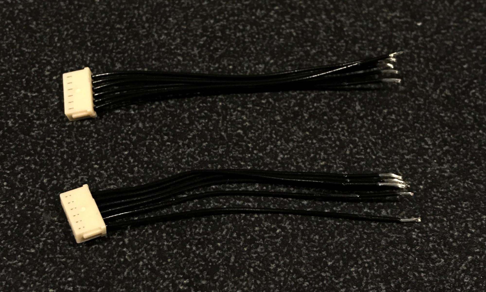
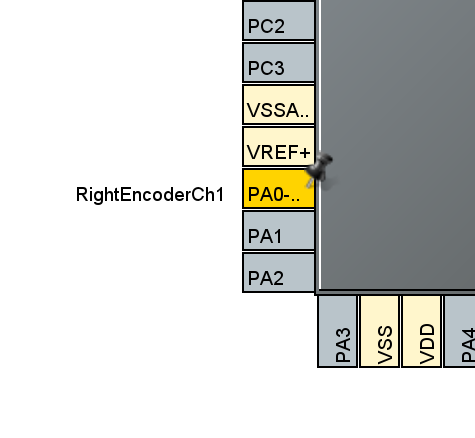
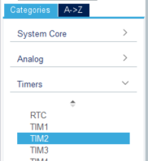
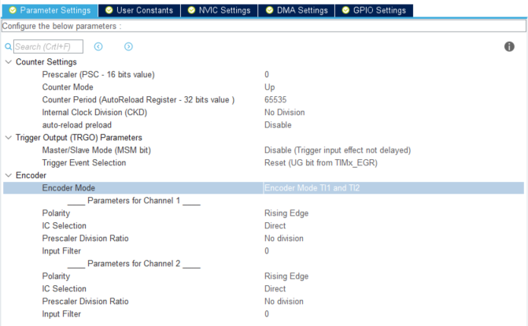
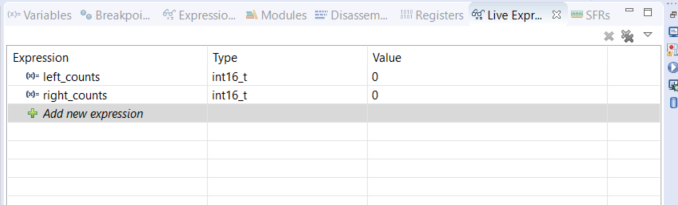
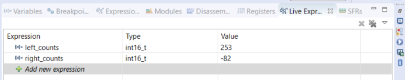
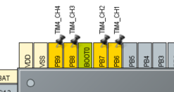
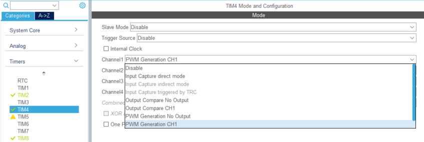
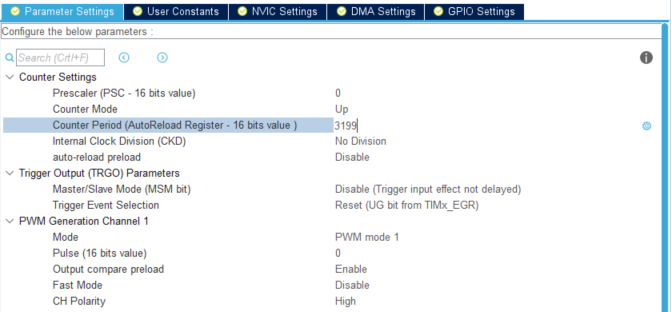

# Motor Setup and PID Module

## Overview

1. [Motor Installation](#motor-installation)
   1. [Soldering on the h-bridge](#soldering-on-the-h-bridge)
   2. [Installing the JST cables](#installing-the-jst-cables)
2. [Software Setup](#software-setup)
   1. [Step 1: Import Code Templates](#step-1-import-code-templates)
   2. [Step 2: Configure Encoders](#step-2-configure-encoders)
   3. [Step 3: Encoder Code!](#step-3-encoder-code)
   4. [Step 4: Configure Motors](#step-4-configure-motors)
   5. [Step 5: Motor Code!](#step-5-motor-code)
3. [Driving with PID](#driving-with-pid)
   1. [Part 1: Straight Line PID](#part-1---straight-line-pid)
      1. [Step 1: Importing Code Templates](#step-1-importing-code-templates)
      2. [Step 2: Enable Systick](#step-2-enable-systick)
      3. [Step 3: Drive in a Straight Line](#step-3-drive-in-a-straight-line)
   2. [Part 2: Segmented PID](#part-2---segmented-pid)
      1. [Step 1: Implement all functions in pid.c](#step-1-implement-all-functions-in-pidc)
      2. [Step 2: Turning](#step-2-turning)
      3. [Step 3: Moving a fixed distance](#step-3-moving-a-fixed-distance)
      4. [Step 4: Acceleration (optional)](#step-4-optional-acceleration)
      5. [Step 5: Traversing a fixed path](#step-5-traversing-a-fixed-path)

In this module, you will continue learning about the STM32CubeIDE, and get the motors working on your mouse. Furthermore, you will learn how to read encoder counts, and use them to implement PID control to make your mouse drive straight and be able to turn!

There's a LOT of code for this module, so if you're stuck or want to verify your answers, you can check them [here](https://drive.google.com/drive/folders/1gwBB0U-VkeGecnpUbbHFzOwJ33mFW20H?usp=drive_link).

# Motor Installation

Before you start using your motors, you need to solder on the components needed to make your motors move! Make sure you solder on the entire h-bridge schematic from the Motors & Encoders Module along with the jst cables.

## Soldering on the h-bridge

When you solder on your h-bridge, make sure that you solder it on in the correct orientation. The tiny triangle on one of the corners of your h-bridge IC should correspond to the little triangle on the silkscreen of your pcb. If you want to be 100% sure you’re doing this correctly, look at your pcb schematic in fusion to double check!

Along with the h-bridge, now’s a good time to solder on the 4 decoupling capacitors that go with the h-bridge.

## Installing the JST cables

The JST cables for the encoders are a bit of a pain to put together, so here’s some detailed instructions on how to get them installed.

- Cut the cables in half, such that each of the cables are about 1.5” long
- Strip the ends of the cables (using a stripping tool, there’s a bunch in the lab)
  - You’ll want to strip enough off that you can solder, but not so much that it shortens your cable significantly.
- Your cables should now look something like this: (imagine these are colorful cables :)

Note the stripped ends on the right hand side of the image

- Now, lay the cables on the mouse such that the wires are oriented correctly. The green wire is ground, so make sure you orient it correctly based on your pcb layout.
  - Double check to ensure you have the cables oriented properly in your own schematics!
- Solder each wire in a line, making sure not to swap any of the connections.
  - This is a little tricky to do. Something that might make it easier is to tape down the wires (the colorful part) after inserting the stripped wires through the holes. This way, you can easily flip the board without worrying about the connector falling out!
  - You could also try to do this one wire connection at a time, retaping the connector every time you solder on another wire.
- Once you’re done, the connections should look like this:

- After you’re done, triple check that your cables are soldered on correctly! You might fry something if there’s any swapped cables!

# Software Setup

## Step 1: Import Code Templates

To save you a little time, we made some code templates that you will complete for this assignment. Download all the files [here](https://drive.google.com/drive/folders/1fLAvUncXzfA2LUG03xG1epKAGCCahB2J?usp=sharing) and add them to the appropriate folders in your project (.h files into Inc, .c files into Src).

Note: you should be able to drag and drop the files into the folders in CubeIDE. This may lead CubeIDE to ask you whether you want to copy the files or just reference them. We recommend choosing to make a copy into the project directory, as this helps keep everything organized (and prevents issues later).

## Step 2: Configure Encoders

Now you need to configure the pins. We will be using a feature on our MCU called hardware encoders, which, as evidenced by the name, uses internal hardware to implement the counting logic covered in lecture. In the Device Configuration Tool in CubeIDE (if you can’t find it, open up the [project_name].ioc file from the project explorer in the left sidebar), set the following pins as such:

| **Pin** | **Setting** | **User Label**  |
| ------- | ----------- | --------------- |
| PA8     | TIM1_CH1    | LeftEncoderCh1  |
| PA9     | TIM1_CH2    | LeftEncoderCh2  |
| PA0     | TIM2_CH1    | RightEncoderCh1 |
| PA1     | TIM2_CH2    | RightEncoderCh2 |

- Note: we chose these pins for the encoders because they are some of the few pins that support **hardware encoders**. If we used different pins, we would need to do a bit more complicated code
- A timer is basically a counter that enables you to do a variety of tasks requiring precise time intervals. There are many timers on the MCU, each one having multiple channels. The channels of a timer can each do separate tasks, but they have to share that same timer.
- Now you will need to configure the timer settings. Expand the Timers dropdown in the sidebar towards the left and select TIM2.

- In the tab that opens up, set Combined Channels to Encoder Mode.

- Once you enable Encoder Mode, down below some settings should appear. In the Parameter Settings tab, set Counter Period to 65535 and set Encoder Mode to Encoder Mode TI1 and TI2.

- Now, repeat everything we just did with Timer 2 but with Timer 1 by selecting TIM1 in the left sidebar.
- NOTE: The counter period in this context is the maximum number of encoder counts that can be stored before the value resets.
  - For example, if it was set to 50, then when rotating the wheel forward, the recorded number of encoder counts would count up from zero to 50, and if the wheel continued turning forwards the value would reset to 0 before continuing to count up.
  - The MCU register storing the encoder counts on Timer 8 is 16 bits, so it can keep track of at most 65535, or 2^16 - 1, encoder counts. However, due to the nuances of how integers are stored in the MCU (feel free to Google the Two’s Complement representation of integers), the range of possible encoder values is -32768 to 32767.
  - You may notice that Timer 2 has a 32 bit register, evidenced by the text “AutoReload Register - 32 bits value” after Counter Period. Even though Timer 2’s counter period could be set higher, we set both to 65535 so they behave similarly. Our MCU does not have 2 separate 32 bit timer registers that can be used concurrently (Timer 2 and Timer 5 are both 32 bit, but cannot be used in encoder mode at the same time), so we settle for 16 bit counter periods.
- NOTE: The encoder mode refers to how the MCU detects encoder changes. Our encoders have 2 outputs, so to take advantage of both we use Encoder Mode TI1 and TI2. This will give us 360 encoder counts per revolution.
- If we instead used, for example, Encoder Mode TI1, the MCU would only look for changes in the signal attached to the TIM#\_CH1 pin, and we would effectively cut our resolution in half and get 180 encoder counts per revolution.
- Feel free to play around with the settings and observe their effects, but obviously we want the highest resolution possible so make sure to change back any changes you make afterwards!
- Click the generate code button!

## Step 3: Encoder Code!

- Navigate to your main.c. In the main function, between the USER CODE BEGIN/END 2 comments (right before the while loop code), add the following:

      HAL_TIM_Encoder_Start(&htim1, TIM_CHANNEL_ALL);
      HAL_TIM_Encoder_Start(&htim2, TIM_CHANNEL_ALL);

- Towards the top of main.c, define the following two variables between the USER CODE BEGIN/END PV comments (PV is for **Private Variables) **that will keep track of our encoder counts:

  int16_t left_counts = 0;
  int16_t right_counts = 0;

- One last step: we want to be able to access the stored encoder counts value! Between the USER CODE BEGIN/END WHILE comments, add the following two lines of code that update the value of the encoders from the timers:

  left_counts = (int16_t) TIM1->CNT;
  right_counts = (int16_t) TIM2->CNT;

- Now we can look at the values of these variables while the program is executing using a CubeIDE feature called Live Expressions.
- To begin, make sure your mouse is powered on and your programmer is connected. Start the debug session with Debug As > STM32 and start your program. (If you forgot how to do these steps, refer to the detailed instructions at the end of assignment 1A).
- A sidebar should have appeared towards the right (assuming you switched perspectives to debug when launching your program; if not then press the debug icon in the upper right hand corner). Navigate to the Live Expressions tab.

- Click Add new expression and enter the name of the variable you want to keep track of and click enter. Do this for both of our variables (the type and value fields should automatically be populated):

- That’s it! If you haven’t already, click the resume button (f8). Now, you should be able to manually turn your wheels and see the encoder counts go up when they are turned forwards and down when they are turned backwards!

- If you’ve made it to this step, congratulations on getting your encoders working! Reading them directly using (int16_t) TIM#->CNT everywhere could work, but is a little confusing to read. Since you will be reading encoders a lot in your code (Foreshadowing for PID?), complete the code template in the encoders.c file.
  - The code here should just be one or two lines per function where you access the encoder values, so nothing fancy
  - Recommended: Try to make spinning the wheels forward yield positive results when read from the “left_counts” and “right_counts” variables
- Go back to main.c and include encoders.h between the USER CODE BEGIN/END Includes comments.
- Go back to where you previously set right_counts and left_counts in the while loop. Replace the (int16_t) TIM#->CNT bits with getLeftEncoderCounts and getRightEncoderCounts.

## Step 4: Configure Motors

- It is pretty exciting getting your encoders set up and being able to see the counts respond to manually turning the wheels. However, you aren’t allowed to push your mouse through the maze, so next we are going to configure your motors!
- To generate PWM signals, we will be making use of timers on the MCU.
- In the Device Configuration Tool window, configure the following pins as such:

| **Pin** | **Setting** |
| ------- | ----------- |
| PB6     | TIM4_CH1    |
| PB7     | TIM4_CH2    |
| PB8     | TIM4_CH3    |
| PB9     | TIM4_CH4    |

- Select TIM4 from the Timers dropdown in the left sidebar, and set the Channel1 dropdown to PWM Generation CH1

- Do the same for channels 2-4
- Below in the Parameter Settings tab, change Counter Period to 3199.

- NOTE: The counter period is chosen with regards to the maximum PWM frequency our motor driver can handle.
- Here’s how we calculated the value of 3199 (for those of you who are curious)
  - The MCU has a clock speed of 16 MHz, and it is able to do something each clock cycle. The counter period is a subdivision of this 16 MHz; you can think of it as the period of our PWM wave in units of clock cycles.
  - The timer’s counter starts at zero and counts up each clock cycle to a certain value (in our case) 3199 before looping back to zero.
  - By setting what is called the channel’s pulse value, we can set how many counts out of the timer’s counter period the output pin should be set high. For example, if the pulse value were 1599, the pin connected to the timer channel would stay on for the first 1600 clock cycles and be off for the remaining 1600. If the pulse value were 799, the pin would be high for 800 clock cycles and low for 2400. The pin will repeat this every time the counter period resets to zero.
  - In the description section of the L293D’s datasheet on the first page ([https://www.st.com/resource/en/datasheet/l293d.pdf](https://www.st.com/resource/en/datasheet/l293d.pdf)) it states “this device is suitable for use in switching applications at frequencies up to 5 kHz.”
  - So, we use 3199 as the counter period in order to achieve an effective PWM frequency of 5 kHz, since 16 MHz / 3200 = 5kHz (we divide by 3200 since the timer’s counter starts with zero rather than 1, so zero to 3199 is 3200 distinct counts).
  - Our PWM duty cycle is calculated as (Pulse / Counter Period) _ 100%. So if our pulse was 800, Our duty cycle would be (800 / 3200) _ 100% = 25%.
- Go to the NVIC Settings tab and check the box to enable the TIM4 global interrupt.

- NOTE: Channels sharing a timer (e.g. channels 1-4 of timer 4) will have the same counter period and counter, but the different channels can utilize the timer’s counter differently and have their own pulse values.
- Click the code generation button! \

## Step 5: Motor Code!

- First, add the following in main.c between the USER CODE BEGIN/END 2 comments:

  HAL_TIM_PWM_Start(&htim4, TIM_CHANNEL_1);

  HAL_TIM_PWM_Start(&htim4, TIM_CHANNEL_2);

  HAL_TIM_PWM_Start(&htim4, TIM_CHANNEL_3);

  HAL_TIM_PWM_Start(&htim4, TIM_CHANNEL_4);

- To keep our code organized, we are going to be putting some functions that handle motor logic into separate .c and .h files. Go to motors.c and follow the commented instructions.
- WARNING: This is mentioned in the comments in motors.c but just in case: NEVER SET BOTH THE FORWARD AND BACKWARD CHANNELS TO NON-ZERO VALUES AT THE SAME TIME. As mentioned in lecture, this can destroy your h-bridge. When setting a channel, always set the other channel to zero first.
- With your functions complete, it should now be pretty easy to get your motors spinning! First, go to main.c and between the USER CODE BEGIN/END Includes comments include motors.h.
- Now, after the HAL*TIM_PWM*… lines, set each motor to a different speed and direction by calling setMotorRPWM and setMotorLPWM!

## DRIVING WITH PID

## Part 1 - Straight Line PID

### Step 1: Importing Code Templates

To save you a little time, we have some code templates that you will complete for this assignment. Download all the files [here](https://drive.google.com/drive/folders/1YAYAiOikv_qf6AqWy-Ixw_rMMY3ggH_6?usp=sharing) and add them to the appropriate folders in your project (.h files into Inc, .c files into Src).

### Step 2: Enable Systick

Systick is one of the functions that we will use on our MCU. It is an interrupt that is called every millisecond, and is asynchronous, meaning it will execute regularly every millisecond regardless of what is going on in the main function.

Systick is perfect for implementing PID control, since the code will execute at regular time intervals. This is especially important for implementing derivative sub-controllers, since we perform those calculations using discrete data points from different points in time.

In your project’s Src folder, open the file named stm32f4xx_it.c

Between the USER CODE BEGIN/END Includes comments, include systick.h

Still in stm32f4xx_it.c file, scroll down and call the SysTickFunction() between the USER CODE BEGIN/END SysTick_IRQn 1 comments.

Press the save all button :

Before continuing, let’s explain briefly how the code is organized and executed:

- Systick.c contains our SysTickFunction(), which gets called every millisecond.
- SysTickFunction should call an update function within pid.c, which is where all the logic corresponding to PID will be implemented and motor speeds are adjusted to help the mouse achieve the goal.
- You will instruct pid.c on what to do (i.e. set the goal state) by calling functions in controller.c. These functions can be things like move (int numberOfCells) or turn (int numberOfDegrees).

This is just a hypothetical way to cleanly organize your code--deviate as you see fit. Our code templates have suggestions about what each function does and some tips on how to implement them.

### Step 3: Drive in a Straight Line

Driving straight is a good place to start for implementing your PID control system. You should implement the following functions in order to accomplish this:

- SysTickFunction in systick.c
- updatePID in pid.c

There is some helpful pseudocode in the code templates folder for completing this assignment. Follow it if you get stuck!

Tips:

- Sometimes the signs of the calculations can be tricky (i.e. add angle correction or subtract it) so try playing around with these. If the motors spin really fast and the error keeps growing, try switching some pluses to minuses or vice versa
- Use live expressions to track your calculated error while you debug your rat

Once you get your code set up, you will need to tune your PD constants. At first your mouse may instantly start spinning out of control, or drive forwards in a very jittery manner. Here are some tips for tuning your PD constants:

- Start with kP and kD both zero. Slowly increase kP until your mouse oscillates a little at the goal.
- Next, increase kD until the oscillations go away.
- Once you have your rough values for kP and kD, experiment with them to try to reach the goal as fast as possible without overshooting.
- Keep your batteries charged, since your motors may behave differently at lower voltage.
- Use a spreadsheet to keep track of which constants you’ve tried. This way, you can easily revert back to constants that worked. Write notes about how the system behaved with each set of constants you try.

Remember, change your constants very gradually! They will likely be quite small. Tuning may take a while, but once your rat’s PID is tuned it will be able to go straight! And the results will be very satisfying. If you are following the pseudo code, to make the mouse drive straight, you only need to tune the **kPw** and **kDw** constants! The distance error is kept at a constant non-zero value to allow for continuous “straight” motion.

That’s all for this part of the assignment. We only implemented a few of the functions in this part of the assignment, but the rest of the next part of the assignment will be very doable if/when you understand conceptually what is going on. Show us your mouse driving straight (or take and submit a video) to get checked off!

## Part 2 - Segmented PID

### Step 1: Implement all functions in pid.c

In Part 1 you only had to implement updatePID in pid.c. Now, you should implement the rest of the functions **before continuing**.

There are some changes you should also make to updatePID. Refer to the pseudocode document for some pointers.

### Step 2: Turning

You will now be working to get your mouse to turn at right angles. The first step is to measure approximately how many encoder counts constitute a 90 degree turn in either direction.

- A good way to do this is to temporarily comment out the part of updatePID that sets motor speed (so it doesn’t try to make corrections during your measurement!) and then using live expressions to view the encoder counts.
- Set your mouse on a flat surface (maybe the lab maze? or just a table) and turn your mouse 90 degrees. Make sure you push down with enough pressure that the wheels don’t slip along the surface.
- Assuming both encoders started at zero, one should now have a positive value and the other a negative value. Take note of the magnitude of their difference. This is the angle error setting to turn 90 degrees.
- For increased accuracy, you could consider turning your mouse some multiple of 90 degrees, and dividing by the number of turns you made.
- Don’t forget to uncomment the motor speed setting code afterwards!

Next, implement the turn function in controller.c. It should set the goal angle in pid.c to some multiple of the amount of encoder counts you measured earlier for a 90 degree turn.

With this done, call turn(1) in main.c before the while loop. Theoretically, your mouse should turn 90 degrees. However, you may notice a couple issues:

- Your mouse turns extremely fast, and possibly overshoots by a large amount. This is because there is no limit on your angleCorrection.
- The mouse continues to oscillate/jitter once it has completed the turn.
- You hear a very annoying (yet sorta quiet) high pitched noise.

Here are some tips to fix these issues:

- The high pitched noise and the jittering are caused by the mouse trying to move “too slow.” For example, if your mouse overshoots by only a couple encoders counts, the PD correction is going to be very small… so small that it is not enough to get the motors to rotate, but enough so that you can hear the sound of them trying to.
- Your mouse may move extremely quickly when turning—so much so that it goes out of control. This is because there is no limit on the angleCorrection value, so the correction may force the motors to spin at their top speed.
- To fix both of these issues, you should limit the angleCorrection! Use the implementation of the limitPWM function in motors.c as inspiration for how to do this.

### Step 3: Moving a fixed distance

Finally, it is time to teach your mouse how to move fixed distances in a straight line! As with turning, the first step is to figure out how far it is you want your mouse to travel.

- Measure the number of encoder counts it takes to move your mouse in a straight line from the center of one maze square to another.
- Your “current distance” is taken to be the average of your left and right encoder counts.

Once you have measured how far your mouse should travel to traverse one maze square in terms of encoder counts, it is time to implement the movement. Follow the pseudocode document for Part 2 for some implementation suggestions if you get stuck!

You should also implement move() in controller.c. It will look very similar to turn().

As with your angle PD constants, you will need to take some time to tune your distance constants.

Once you finish, try calling move(1) in main.c. If all goes well, your mouse should move forwards one maze cell!

Tips:

- We recommend you limit the distance and angle corrections individually. For example, if your max motor pwm is 0.8, perhaps you could limit your distanceCorrection to be between -0.5 and 0.5, and your angleCorrection to be between -0.3 and 0.3. That way their sum will always be in the valid range.
- The distance constants kPx and kDx matter much less than the angle constants kPw and kDw. If something is wrong with your rat’s movement, it is most likely an issue with the turning constants.

### Step 4 (Optional): Acceleration

If you run the move function right now, you might notice that the mouse goes immediately to your max speed when the movement starts. This is just due to the nature of the PD controller. Unfortunately, this instant speedup is a bit hard in the real world because **it takes time for objects to accelerate **(good ol’ _F = ma_).

What your velocity may look like if you reach max

speed with gradual acceleration

You may or may not find it worth it to implement gradual acceleration and deceleration when changing speeds. This will be especially useful if you are going for higher speeds and traversing multiple cells with one move function.

The actual implementation should be simple:

1. Define an acceleration constant
2. Compare Motor Speed calculated by the PD controller w/ Previous Motor Speed
3. If difference between two motor speeds > Acceleration Constant
   1. Motor speed = Previous Motor Speed Acceleration Constant

This should be relatively consistent because updatePID() is run every millisecond by Systick. This acceleration step is optional because it is much more useful when you are traveling multiple cells in one move function like move(5) and want to reach higher speeds. You will most likely not have to travel multiple cells at once yet, but this may be useful in Winter and Spring quarter when we learn how to “remember the layout” of the maze using **Floodfill**.

### Step 5: Traversing a fixed path

If you have reached this point, you are almost there! 99% of the work was effectively implementing your turn() and move() functions.

The final step is to utilize your turn and move functions (probably in main.c before the while loop?) to traverse a path of your choosing through a maze. Remember, your mouse must move at least 6 cells and make at least 3 turns!

Remember to exit out of the move and turn functions once the mouse has achieved a reasonably low error with respect to the goal. Not doing so will cause the program to not move onto the next action command!

After you finish… CONGRATULATIONS! You have taught your mouse how to blindly follow a fixed path using PID control. Once you give your mouse eyes (IR sensors) in the next assignment, it will be able to follow any path!
