# Motors and Encoders Module

## Overview

1. [Types of Motors](#types-of-motors)
2. [Motor Control](#motor-control)
   1. [Transistors](#transistors--motor-onoff-state)
   2. [H-bridges](#changing-motor-direction-with-h-bridges)
   3. [Pulse Width Modulation](#controlling-speed-with-pwm)
3. [Encoders](#encoders)
4. [Motor Control Schematic](#motor-control-schematic)
   1. [H-bridge](#step-1-add-the-h-bridge)
   2. [Motor Headers](#step-2-add-the-motor-headers)
5. [Parts](#parts)

In this module, you will learn about the different types of motors and encoders available on the market, and the pros and cons of each in the context of micromouse. We will also teach you about the circuitry to control the motors with h-bridges, and how we actually control each motor using PWM signals. Finally, we will wrap things up with a small list of parts (for motors and encoders) that we recommend you use for your mice!

As with the previous module, an alternative form of learning the contents in this module are the UCLA Micromouse lecture videos. If you watch the following video, you can skip to the

[Motor Control Schematic](#motor-control-schematic) section of this module:

[Micromouse 2022 Lecture 2: Motors and Encoders](https://youtu.be/CjEYVcPu2vM?list=PLAWsHzw_h0iiPIaGyXAr44G0XfHfyjOe7)

## Types of Motors

1. Brushed Motors

   1. Basic principle: they have a massive magnet (1 south and 1 north pole) surrounding a coil. When current is passed through the coil, a small electromagnet is created which tries to align itself with the surrounding magnet. This causes it to spin. Right before alignment, the direction of current flow through the coil is switched, leading to the coil spinning continuously as long as it’s powered.

   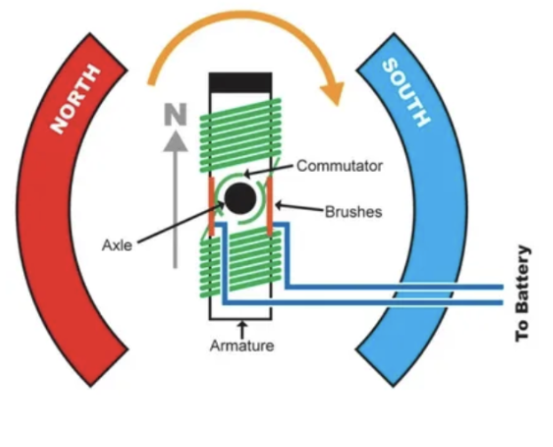

   2. Common uses: RC cars, mills
   3. Advantages:
      - DC Power - plug & play; much easier to use than brushless motors which use AC power
      - Cheaper
   4. Disadvantages:
      - Less accurate & precise than brushless motors
      - Less efficient - the “brushes” create friction leading to power loss

2. Brushless Motors

   1. Basic principle: they have a spinning magnet in the middle with a bunch of coils surrounding the magnet. When current is sent through these coils in a specific order, it creates electromagnets in such a way that the magnet in the middle spins.

   

   2. Common uses: RC planes, electric vehicles, heavy machinery (ex: CNC machines)
   3. Advantages:
      - More precise
      - More accurate
   4. Disadvantages:
      - AC Power - much more complicated to use & a lot harder to work with
      - More expensive

| 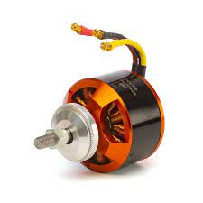 | 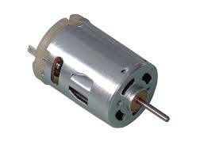 |
| ----------------------------------------------- | ------------------------------------------------ |

On the left is a brushless motor and on the right is a brushed motor.

## Motor Control

There are 3 main challenges when it comes to controlling a DC motor with a microcontroller: turning it on & off, changing the motor’s spin direction, and setting its speed. We will explore the ways we overcome these challenges by using transistors, h-bridges, and pulse width modulation!

## Transistors & Motor on/off state

At this point, you might be wondering how hard it could possibly be to turn on a motor with a microcontroller. Just plug it into the MCU and you’re good to go… right? Unfortunately this isn’t possible since the mcu simply cannot provide enough voltage or current to run the motors; the MCU can provide 3.3V & very little current compared to the motors’ 6V operating voltage.

Solution: connect the motors directly to the battery and use the mcu as a “switch” to turn the motor on & off. We can accomplish this by using <ins>transistors</ins>.

1. NPN transistors (the ones we’ll be using) act like an open switch until a small current is applied to their base, at which point they let current flow between the collector & emitter.

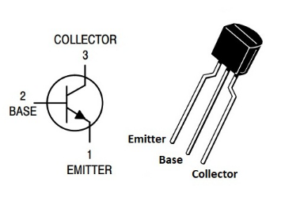

2. This small current can be provided by an MCU I/O pin, meaning we can control the flow of current between the motor & battery with the MCU with this simple circuit:

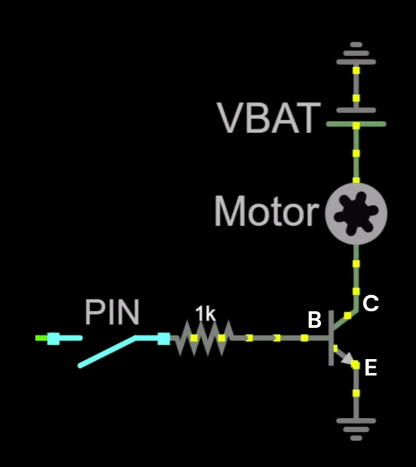

3. One last thing: <ins>flyback diodes</ins>. When the motor is turned off, it creates a changing magnetic field, which can induce current in the wire (aka back emf). This can be dangerous for other components of the mouse, causing them to be damaged. We can fix this problem by using a flyback diode.
   1. Diodes only allow current to flow in one direction (from the anode to the cathode), so we can use a diode to send the back emf into the battery to avoid harming the rest of the circuit!

## Changing Motor Direction with H-bridges

Changing DC motor direction is relatively easy: all you have to do is change the direction of current through the motor (by switching the battery terminals) to make it spin the other way!

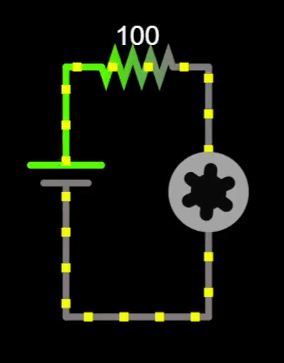

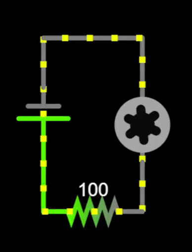

We can use this principle along with a circuit called an <ins>h-bridge</ins> to efficiently control motor direction. This circuit consists of 4 transistors & 4 flyback diodes, modeled by switches in the following diagram:

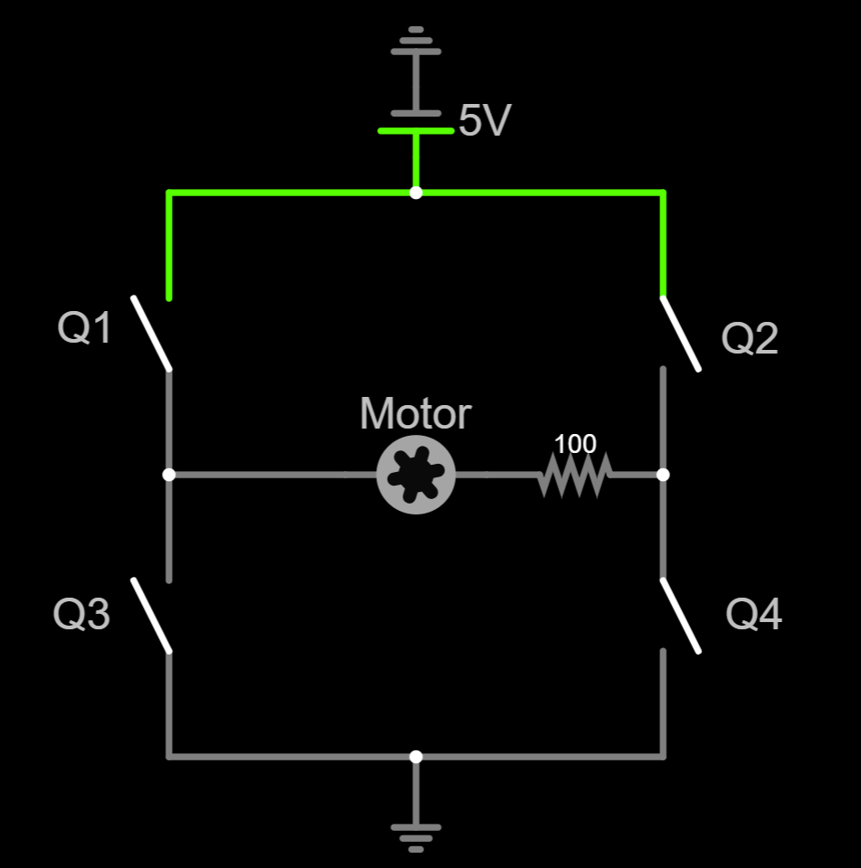

1. When we close switches Q1 & Q4 while leaving Q2 & Q3 open, current will flow through the motor from left to right, causing the motor to spin clockwise:

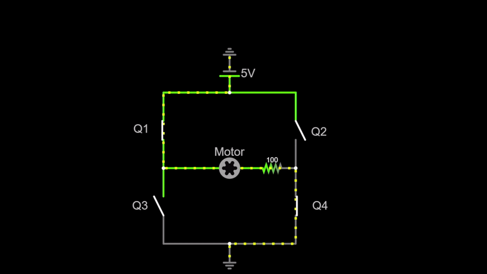

2. When we close Q2 & Q3, the motor spins counterclockwise:

3. WARNING: do NOT close all 4 switches at once! This will lead to a short and will damage the battery!

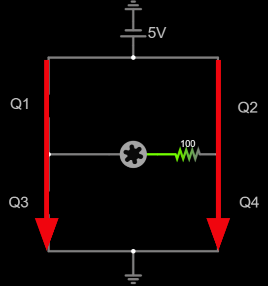

4. The full h-bridge schematic looks like this with the flyback diodes & the transistors:

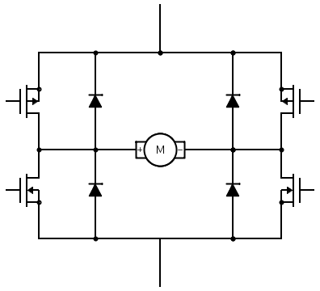

For the purposes of micromouse, we don’t really want to make our own h-bridge from scratch. Instead, we can use an h-bridge IC (the L293DD H-Bridge). This small chip has 2 h-bridges built in (one for each motor). It has 4 inputs (2 for each motor), each of which control 2 transistors. This way, we only have to use 4 mcu pins to control both motors! Finally, the h-bridge has 4 output pins (2 for each motor) which connect directly to the motor power. Furthermore, these ICs have 2 enable pins which take a steady 3.3V to “activate” the h-bridge.

L293DD H-Bridge Pinout:

## Controlling Speed with PWM

So far we’ve covered how to control motor on/off state & direction, but what about speed? Motor speed in general depends on the voltage being applied to the motor. The higher the voltage, the higher the speed. The only problem is that the microcontroller sends a digital signal to the h-bridge, and digital signals only have 2 states: on or off. While we can’t directly control the voltage being applied, we can change the average voltage the motor receives using a PWM signal.

1. A Pulse Width Modulation (PWM) signal can change the average voltage by rapidly turning the motor on & off at a fixed frequency. When the signal is on, the motor tries to move at full speed, and when it’s off, the wheel’s inertia will keep the motor spinning. A good analogy is that of riding a bike. Instead of constantly pedaling at full speed, you keep switching between pedaling and cruising, leading to a slower speed.
2. The <ins>duty cycle</ins> is the amount of time on as a percentage of the total time. The higher the duty cycle, the higher the speed!

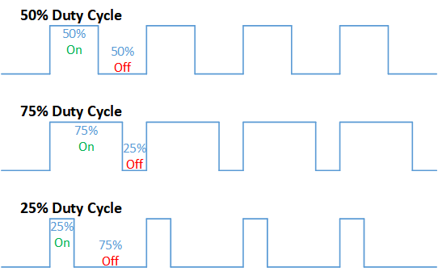

For now, it’s sufficient to understand the basic principle of PWM signals and how/why they work. We will cover the specifics of implementing them with software & MCU timers in a later module.

# Encoders

Now that you know how to control motors, let’s talk about how your mouse will know where it is with the use of encoders! <ins>Encoders</ins> tell us how much each wheel has rotated, and in what direction. Using this information, we can tell where in the maze the mouse is at any given time!

The encoders themselves are attached to the back of each motor, and take the basic form of a disk that spins with the motor. Furthermore, there’s a sensor that detects how much the disk has spun, based off of which you will know how much the wheel has turned. There’s 2 ways encoders can detect disk rotation:

1. Magnetic encoders: in these, the disk is a multi-pole magnet surrounded by hall effect sensors that can detect changes in magnetic fields. When the disk spins, the hall effect sensors can read how much it has spun based on the number of poles that pass by.

2. Optical encoders: in these, the disk has little slits in it, with a light on one side and a light break sensor on the other. When the disk spins, the sensor keeps seeing “flashes” of light which it can use to tell how far the motor has spun.

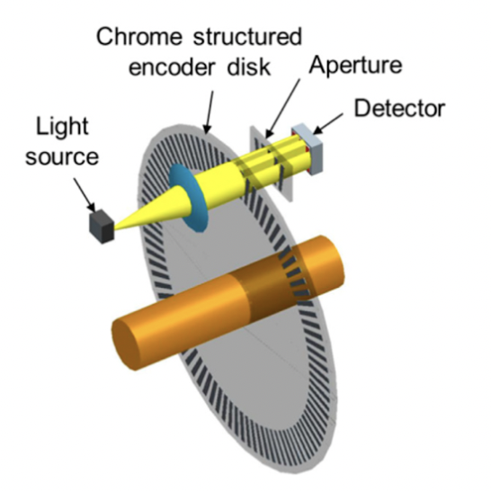

For micromouse, we will be using magnetic encoders because they are cheaper, and can tolerate things like vibrations and crashes (which happen a lot in micromouse) a lot more than optical sensors can.

The specific magnetic encoders we use have 6 poles and 2 hall sensors placed at a 90 degree angle from each other. As the motor spins, one of the hall sensors will detect a pole every 30 degrees of the motor spin, which is 1 encoder count. The encoders can detect spin direction using the phase difference between the 2 hall sensors (i.e. the different ordering of poles the 2 detect based on spin direction).

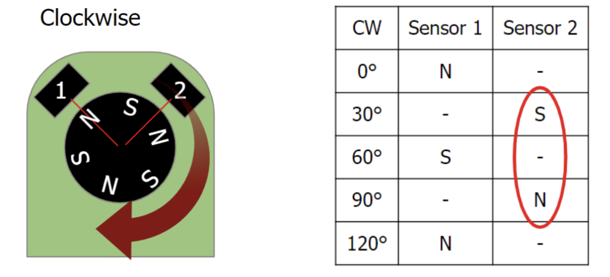

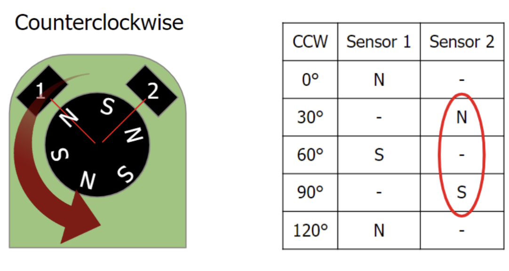

With a 30:1 gear ratio, 30 degrees per encoder count translates to 360 encoder count per wheel rotation as shown below, which is more than accurate enough for our purposes!

Encoders Count every 30°

(360°/rotation) / (30°/count) = 12 counts/full motor rotation

12 Counts/motor rotation \* 30:1 Gear ratio = 360 counts/wheel rotation

## Motor Control Schematic

In this assignment, you will add the H-Bridge and motor headers to your existing schematic from the power module. In doing so, you will gain experience in grouping and making connections using labels in Fusion 360.

## Step 1: Add the H-Bridge

There are 2 main options when it comes to h-bridges: smd and through hole. The smd has the advantage of being smaller, whereas the through hole component has the advantage of being easy to replace if it’s fried (you can just pop it out and place in another one).

- The [L293DD](https://www.digikey.com/short/49nhw93r) is an SMD version of the same H-Bridge, which is what we recommend you use in your schematic. The through hole version is the L293D and it has the exact same schematic.
  - Using the through hole h-bridge will lead to a much easier time soldering, as you first need to solder an IC socket and then just insert the h-bridge into the socket. This also means that if you accidentally fry your h-bridge, you can easily pop it out and replace it:

IC socket:

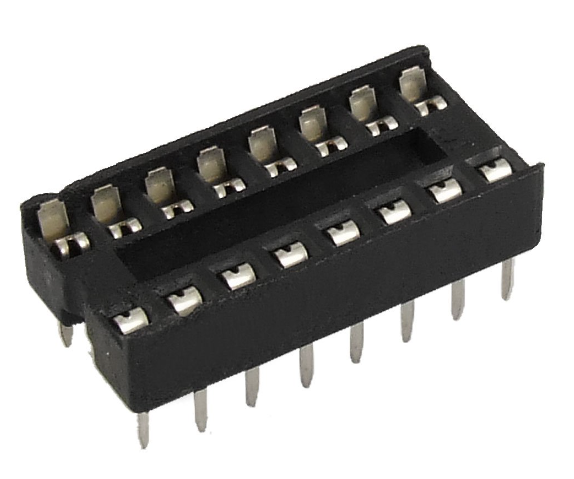

- You are also free to use a different H-Bridge or switch it out later if you want, we just don’t want to overwhelm you right now :)

Here’s how the H-Bridge is connected to the microcontroller on your Rat:

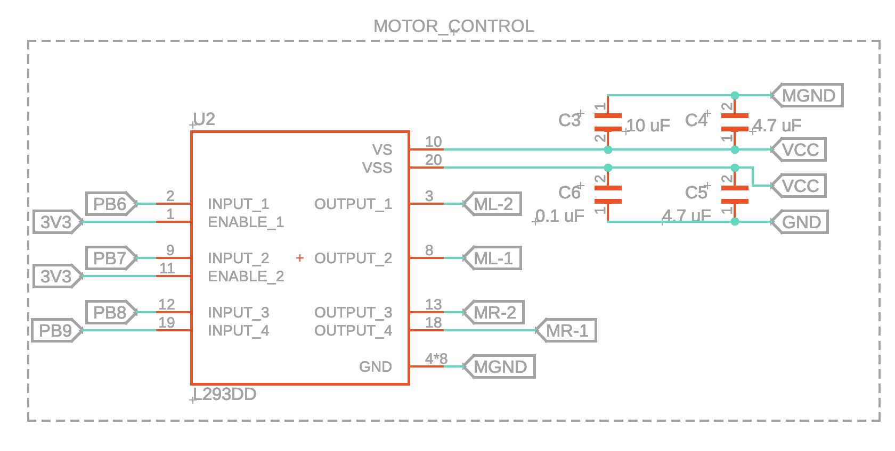

- Don’t worry if your components look a little different (especially passives like the capacitors in the picture above). This happens because different manufacturers like to use different models for their components.
- Make sure that you connect 3V3 to the enable pins and have a separate MGND for the motors like shown above!
- You can rotate and move the names and values of the parts by right clicking on the gray plus signs next to them and selecting the appropriate option.
- Using the VCC arrow symbol or a label called VCC are equivalent. Same applies to GND!

:::note

VS is the Supply Voltage and VSS is the Logic Supply Voltage. Logic Supply Voltage is simply the voltage level required to power the logic circuits.

:::

Let's break down what we’re looking at here.

Notice how each of the H-Bridge pins are connected to those pentagon things? Those are called **<ins>labels</ins>**, and we use them here to make distant wire connections much cleaner. As a refresher from assignment 1B, how they work is you can label any wire with a custom name, and any wires that are labeled with the same name are considered connected in the software.

- To label wires, use the label tool:

- Then, to set the label style to the box, press this button: (on popup)

Speaking of labels, recall what we learned in lecture about dual H-Bridges. We have a total of 4 input wires connected to pins on the microcontroller (PB6-9), 2 input wires to control each motor. And the output pins go directly to the motor, which we will connect with the M*-1 and M*-2 labels

Lastly, we have the power and ground connections. Recall from the power delivery schematic that the decoupling capacitors are there to smooth out the voltage supply.

Two More Things:

- To avoid any possible confusion, ML-1 and ML-2 are the motor connections for the left motor and the rat, and MR-1 and MR-2 are for the right motor
- Fusion 360 also allows you to designate groups within your schematic so you can label different parts of your schematic according to their function. Just select the components you want to group, right-click on one of the components, and press “New Group.” It makes things a lot nicer to look at :)

## Step 2: Add the Motor Headers

For the wires connected to the motor JST cables, notice that we simply solder the wires directly to the PCB. You may choose to model your board differently, but we opted for this design for space efficiency and simplicity.

To model this on the PCB in Fusion 360, we just used some of the default library headers, since we won’t be actually putting a part in their spot. Technically, you could use some other sort of connector for your mouse, but for now let’s just put headers there.

To find generic headers in Fusion 360, just find the library “pinhd”, and find a 1x6 header for the motor connections.

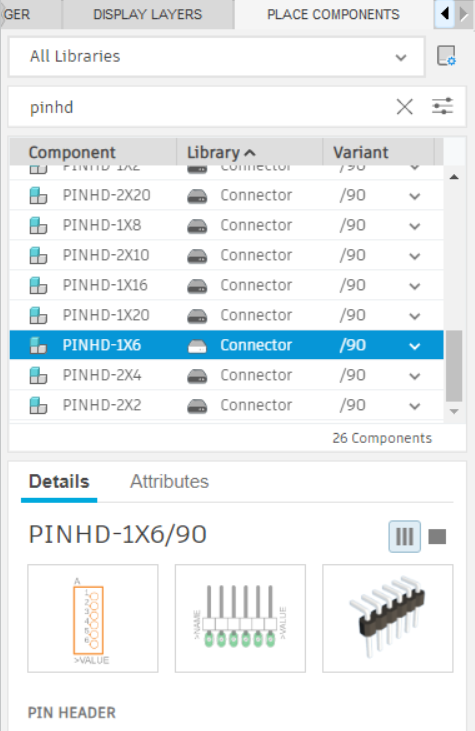

Use two of these to create the connections for your motors / encoders.

You can use this image (from the pololu website, link in the
[Parts ](#heading=h.4n1u2g83q58d)section) to get the pinout of the encoders, for now it doesn’t matter which direction you attach them since you can rotate things when designing your PCB.

M1 and M2 are the motor connections, so use labels to connect them to the motor output pins you defined earlier. VCC for our encoders is the same as 3V3, so just connect that pin to 3V3. GND in the picture above is only for the encoder, and not for the motor power.

Output A/B are the encoder connections, which are connected to specific pins of the microcontroller. Since we don’t know exactly which pins on the mcu we will be using for these yet, you can just label them something symbolic that you will remember. Another thing to note about Output A/B is that in the mcu software, output A corresponds to encoder channel 1 & output B corresponds to encoder channel 2 (each motor will have both channel 1 & 2).

When you’re finished, your motor headers should look something like this:

And just like that, we’re done with the schematic for the h-bridge and motor headers!

## Parts

For our purposes in micromouse, the specific motors we will be using are these dc [motors on pololu](https://www.pololu.com/product/2378). You may notice that they have a 30:1 gear ratio, which means that for every 30 rotations of the motor, the gear box will translate that to 1 actual spin of the wheel. You do not have to use 30:1 motors, and some other options include 20:1 and 10:1 gear ratios (you can also go higher than 30:1), all of which are fine. Just keep in mind that a higher gear ratio means lower top speed, but better encoder counts (which means that PID is much easier to implement and your mouse will be more precise). Another thing to keep in mind while choosing motors: make sure you get motors with an extended gear shaft so you can use encoders.

For encoders, we recommend going with [these magnetic encoders](https://www.pololu.com/product/4760) (also from pololu). The advantage of using these is that they can be attached directly to the back of the motors.

Finally, these are the specific [wheels ](https://www.pololu.com/product/1088)and [gearbox brackets ](https://www.pololu.com/product/1086)we will be using for the rest of the tutorial, but feel free to find your own if you’re using a different motor or want different wheels!
