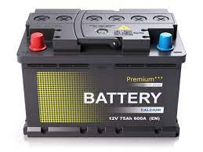
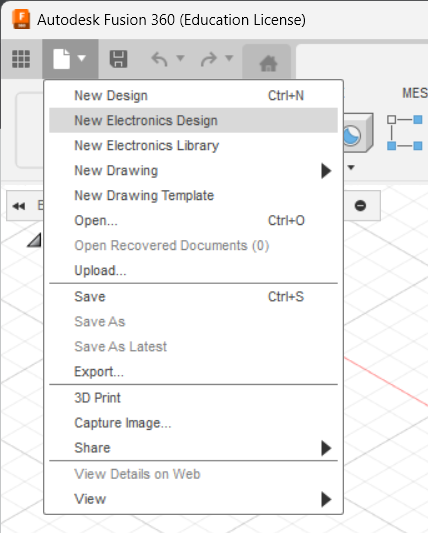
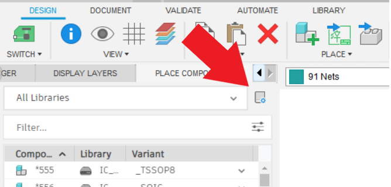
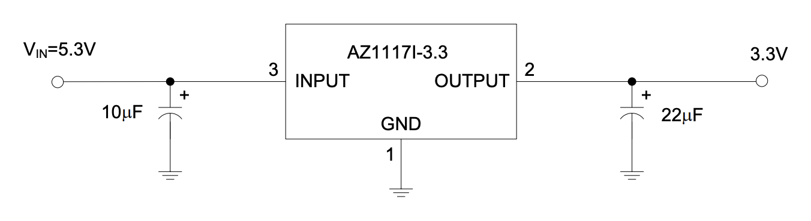
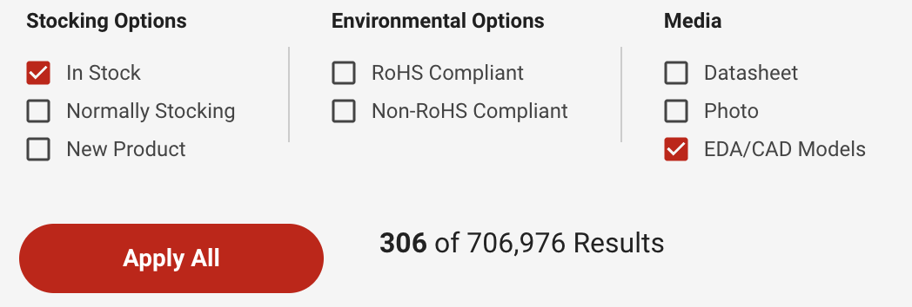
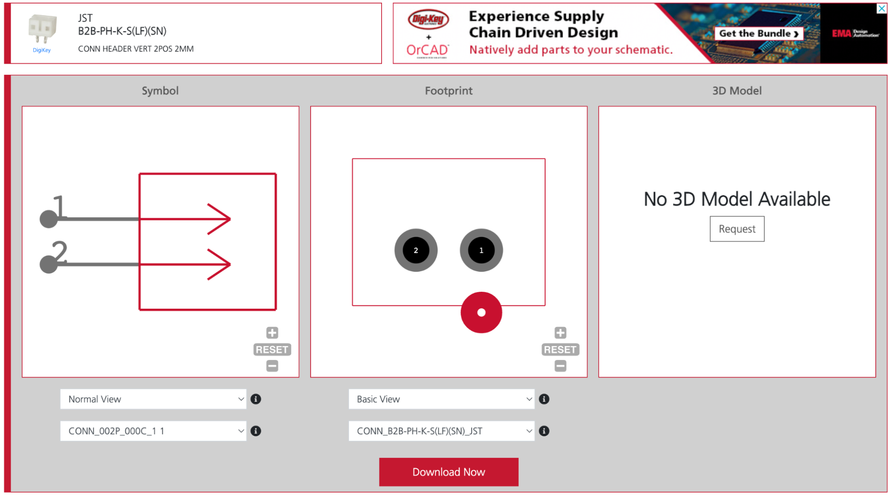
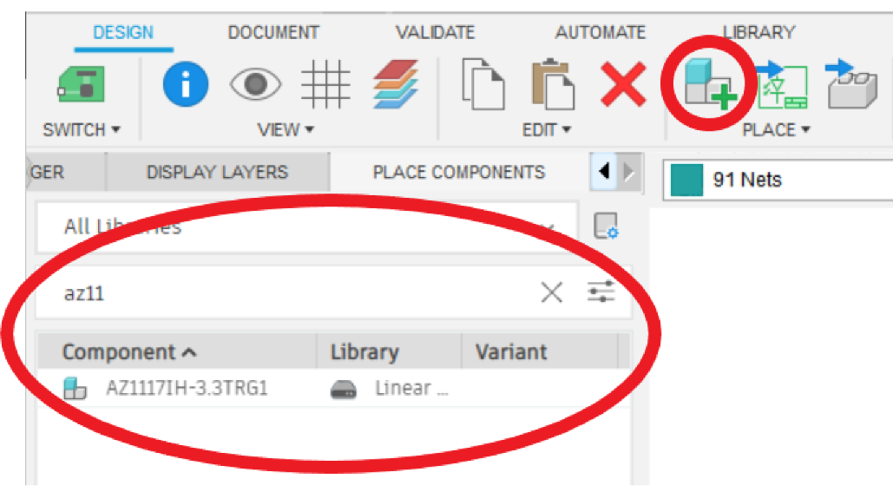

# Power Module

## Overview

1. [Types of Batteries](#types-of-batteries)
2. [Battery Safety](#battery-safety)
3. [Voltage Regulator](#voltage-regulator)
4. [Power Delivery Schematic](#power-delivery-schematic)

In this module, you will learn about the various types of batteries and the overall basic layout of the power schematic, as well as get started with the basics of PCB Design. By the end of the module, you will learn why we use the batteries we do in micromouse (and how we use them), as well as have created your first schematic!

An alternative form of learning to these modules are the UCLA IEEE lecture videos. We highly recommend watching them if you have any doubts as you read through the modules, or if you just want to watch a lecture video instead of going through the modules yourself. Just note that there will be other things talked about in the videos (like talk about the “rat” which is UCLA’s beginner micromouse), so just keep that in mind. Also, we’ll be using Fusion360 to design our schematics and PCB in these modules, compared to Eagle (a different circuit/pcb design software very similar to Fusion360) which you might hear in the lecture videos.

If you choose to watch the following lecture video, you can skip to the [Power Delivery Schematic](#heading=h.7oudxigu3d8l) section of this module:

[Micromouse 2022 Lecture 1: Introduction and Power](https://youtu.be/UHWE3d_au30?list=PLAWsHzw_h0iiPIaGyXAr44G0XfHfyjOe7)

## Types of Batteries {#types-of-batteries}

1. Lead Acid Batteries
   1. Used in power systems & vehicles
   2. Advantages: cheap, easily to charge
   3. Disadvantages: big & bulky

2. Nickel-Metal Hydride Batteries 4. Used in a lot of day to day applications/tools 1. Ex: some AAA rechargeable batteries are nickel-metal hydride batteries 5. Advantages: cheap, easy to charge 6. Disadvantages: limited lifespan (~2-5 years), low voltage per cell

3. Lithium Ion Batteries 7. Used whenever there’s a need for high power density for less weight 2. Ex: drones, electric cars 8. Advantages: energy dense, light, come in a large variety of form factors 9. Disadvantages: expensive, complex charging

4. Lithium Polymer Batteries (used in micromouse) 10. Similar to Li-Ion batteries; slightly less energy dense than Li-Ion but also a lot lighter and won’t lose maximum power output as quickly as Li-Ion

### Our Specific Battery Specs

1. We use two 3.7V LiPo batteries
   1. Motors need 6V to run; these 2 batteries should easily be able to provide that
2. 1200 mAh capacity
3. 1A continuous current discharge

## Battery Safety {#battery-safety}

1. The obvious: don’t do stupid things!
   1. Don’t stab the battery
   2. Don’t throw it
   3. Don’t try to rip out the wires
2. If the battery gets puffy or feels squishy (i.e. you can bend it very easily), stop using the battery

3. Never discharge the battery below 3.0V per cell (a good lower limit is 3.4V) 4. You can measure battery voltage using a multimeter; just plug in the battery and place the probes on the battery connector pins
4. Only use the chargers that come with the battery. They will look something like this:

## Voltage Regulator {#voltage-regulator}

1. Why do we need this? Can’t we just use the batteries directly?
   1. Normally, the batteries’ voltage changes with things like the motors turning on & off, leading to spikes and drops in battery voltage
   2. This could lead to the MCU randomly shutting off when there’s a massive drop in voltage
   3. Voltage regulators prevent this by making sure the MCU receives a stable source of power
   4. Additionally, they lower series battery voltage to an acceptable level that can be passed into the MCU

2. How do they work?
   1. They behave like a variable resistor with an operational amplifier that adjusts current to keep Vout constant
      1. They burn off excess voltage
   2. The schematic will also have a few decoupling capacitors to account for voltage drops
      1. Remember, capacitors act like mini voltage sources that can discharge whenever there’s a drop in voltage

### Learning Checkpoint

Which one of the following could happen if we don’t use a voltage regulator?

1. The mcu won’t get enough voltage to allow it to run properly
2. The motors won’t get enough voltage to allow them to run properly
3. The mcu won’t get a stable voltage source, causing it to restart due to drops in voltage

   
Answer

   

      3. The mcu won’t get a stable voltage source, causing it to restart due to drops in voltage
   

## Power Delivery Schematic

Now that you know the theory behind the power delivery system of the mouse, let’s actually build it in circuit design software! If you already know how to use a circuit design software, feel free to skim this section, but we highly recommend that you take your time and familiarize yourself with Fusion 360 as we will be using it to design the entire mouse’s pcb, starting with the power delivery schematic!

Here’s the basic circuit schematic that we will be making:

In our case, the “Unregulated input from power supply” is just our battery voltage and the “Regulated Output” is a clean 3.3V signal that we can then use to power our components.

First, we will walk you through the Fusion 360 installation process, and then a step by step guide on how to use it!

Autodesk has changed the way their licenses work, so there might be some issues with student licenses not working for Fusion. Try installing the student version if you can, but if that doesn’t work, you can make do with the free limited version (directions below).

Fusion 360 is not the only pcb design software! There are plenty of alternatives such as KiCad, Altium, and Eagle. Although we will be using Fusion 360, you’re free to use whichever software you want to use as most of the features will be the same and the basic principles will carry over to whichever software you want to use (or will use in the future).

## Step 1: Register for an Autodesk Student Account

- Create a student account [here](https://www.autodesk.com/education/free-software/eagle) ([https://www.autodesk.com/education/edu-software/overview](https://www.autodesk.com/education/edu-software/overview)). Press “CREATE ACCOUNT” unless you already have one registered to your school account.

- Fill out the form. You may use either your school or personal email address.
- Once you submit the form you will receive a verification email; verify your email.
- You will then be taken to a page where you need to type in some information about your school and when you graduate.

## Step 2: Installing Fusion

- Visit [this link](https://www.autodesk.com/education/edu-software/overview?sorting=featured&filters=individual) and sign in at the top right.
- Then click “Get Product” under Fusion 360, select your operating system, and click install.

- Run the installer!

## Step 3: Create Project and File in Fusion 360

- After opening Fusion 360 and signing in, if the left bar does not show up (shown in the image on the left), click on the top left icon (shown in the image on the right)

| If you don't have this screen...                          | ...click the circled button                                        |
| --------------------------------------------------------- | ------------------------------------------------------------------ |
|  |  |

- Click on “New Project” and name your new project a fitting name.
- After creating a new project, click File → New Electronics Design in the top left:

- In the electronics design screen, click Create → New Schematic:

- Finally, go to File → Save and give your schematic a name and click Save:

## Step 4: Obtain Part Libraries

:::note

These instructions are very verbose, such that you should be able to find instructions if you get stuck. That said, if you have done schematic design in Fusion 360 or some other program before, you are welcome to skim this section.

:::

In Fusion 360, you cannot just start adding down resistors and capacitors and whatnot. The first step is to obtain what are called libraries for all your parts. The schematic is based on real-life components, and libraries contain all the physical size and mounting information about a part. Libraries contain a part’s symbol, PCB footprint, and its different connections or “ports.” You can design your own library for a part, but most of the time, including now, you can easily get all the part libraries online.

Note that Fusion 360 already has a very robust library of parts that should cover most of what you need, but finding the exact part libraries for the specific parts you are using ensures that the footprint for your components are correct.

Digikey is a good supplier of electronic parts, so this tutorial will reference parts off their website (Digikey plz sponsor us). We recommend the [AZ1117IH-3.3TRG1 Voltage Regulator](https://www.digikey.com/en/products/detail/diodes-incorporated/AZ1117IH-3-3TRG1/5699682) (an SMD version of the regulator), although you are free to find your own if you so choose. While the part and its datasheet are on Digikey, there is not a library or “EDA libraries” on Digikey for this specific part, so you will need to find it elsewhere.

- A good place to start when looking for EDA libraries is [SnapEDA](https://www.snapeda.com/). Go to their website and type in AZ1117IH-3.3TRG1 (if you are using our recommended regulator) and click on the correct result. You should now see a page like this:

- You’ll need to create an account before you can finish downloading the part. Go ahead and register; you’ll likely be using SnapEDA a lot going forward!
- Click “Download Symbol and Footprint” and then click “Autodesk Fusion 360” in the following prompt.
- For each library you download, you’ll need to import them to Fusion 360. Start by clicking the library manager button:

- In the window that pops up, click the “Import Libraries” button and then on “Import from local disk”. Select the .lbr file you just downloaded from SnapEDA and press open. All done!

:::note

At this point, the library part you downloaded & imported might have a name that’s not easy to remember or search up when you need it. We recommend that you rename the .lbr files before importing them. It will also be significantly easier & more organized if you store all the library files you use in a single folder on your computer so it’s easier to find while importing!

:::

On page 2 of the regulator, you can see it needs a 10 μF and a 22 μF capacitor:

We will walk you through selecting an appropriate 10 μF capacitor, and then you will find the other one on your own.

:::note

Fusion 360 has built in libraries for several passives, so another way to do this is to find SMD capacitors in Fusion 360 and use those, and then when ordering actual parts find your own capacitors with the correct size/value online. For now, however, we will just find the product page for all the parts we use and get the libraries that way. Good practice downloading libraries :D

:::

- On Digikey, start by just typing “capacitor” into the search bar. Then select “Ceramic Capacitors.” There are other categories you could use as well, but ceramic SMD (surface mount) capacitors are what we have in mind for this board. You could use through hole components, but SMD components are more space efficient and we think they look nicer.
- Start by setting the appropriate filters. Set capacitance to 10 μF and mourning type to surface mount MLCC (multilayer ceramic capacitor). Set package/case to “0805 (2012) Metric).” This last option refers to the dimensions of the capacitor; 0805 is a good size that is compact but also easy to hand solder. Another good option if you’re more experienced with soldering is the 0605 size, used on most UCLA micro-mice. Designs in industry tend to use even smaller packages (usually down to 0402 or 0201), but we will stick with 0805 for now.

- You should also check the “In stock” checkbox (to make sure the part is actually available) and the “EDA / CAD Models” checkbox. You may need to click “More Filters” to see this as an option. Some parts may not have any EDA models on Digikey but usually generic passives like these capacitors will, so this just saves you time searching elsewhere for the model, as we did for the regulator.
- Click “Apply Filters”

- Scroll through the results and find a capacitor with a reasonable tolerance and with a voltage rating higher than 8.4 V (since this is generally the max voltage of our combined batteries). We chose [this capacitor](https://www.digikey.com/short/2vnhpw9n).
- Once you’re on the product page for the capacitor you chose, go to the Documents & Media section, to find the link listed by EDA / CAD Models. Click it and it will take you to the part page on SnapEDA. Now just follow the same procedure from before that we did for the regulator!

:::note

It is good practice to keep track of your parts in a spreadsheet somewhere, referred to as a Bill of Materials or BOM. If you make a Digikey account and order all your parts from there, they have a BOM Manager feature that takes care of this for you (all you have to do is hit “Add to BOM” on the product page). But, if you make your own spreadsheet, you have more flexibility in what information you keep track of and how you format it. We recommend you create your team’s BOM early, as you will need to create a BOM later on when you design your Mouse. Some things you should keep track of in a BOM are part prices, quantities, values, and a link to the component’s product page. For example, below is a screenshot of the BOM for a different mouse:

:::

We’ve walked through finding a library for the 10 μF capacitor. Now, on your own, find a 22 μF capacitor library on Digikey!

Lastly, you will need a way to connect the batteries to the rest of the PCB, including to the breakout board.

- To connect up the batteries, you will need 2 JST connectors. Use [these ones](https://www.digikey.com/product-detail/en/jst-sales-america-inc/B2B-PH-K-S-LF-SN/455-1704-ND/926611) as they are the correct size and configuration for the batteries.
  - You may notice that in the Documents & Media section, there are two different EDA library links provided, one to SnapEDA and the other through Ultra Librarian. While you can use the SnapEDA one, we will walk through how to import parts downloaded from Ultra Librarian since some parts on Digikey only have EDA models available through Ultra Librarian.
- Click the bottom link:

- You will see a page like this:

- You will need to register for an Ultra Librarian account to download, so do so.
- Once logged in, click “Download Now.” Expand the Autodesk section and check the box next to Fusion 360 PCB Library. Then press Download!

- This will download a zip folder. Extract its contents and open the folder. Enter the “Fusion360” folder. You should see the .lbr file for the JST connector!
- Now all that’s left is importing it to Fusion 360 using the library manager like we did with the voltage regulator!

These are all the parts you need for the power delivery schematic. However, we recommend you spend some time looking into adding a switch and possibly even a power indicator LED. Research the parts, find them on Digikey (or other suppliers if you want, like Mouser), save the link in a BOM spreadsheet you make, and import their libraries into Fusion 360. This will not only be awesome and make your design more useful, but will also give you practice researching your own parts and help you get comfortable importing parts to Fusion 360.

## Step 5: Make Your Schematic!

Finally, it is time to make the actual schematic!

- When starting off, we need to place all our components into the schematic. Click the Place Component button:

- Find your parts. Let’s start with the voltage regulator. Find “AZ117IH…” in the “Place Components” window on the left:

- Double click the component to select it. Drag and drop your component somewhere! Just left click to place it. Should look something like this:

- You can right click before you place the component if you want to rotate it.

:::note

You might notice that the actual voltage regulator has 4 pins whereas the schematic on fusion 360 only has 3. This is because the people who made the schematic decided to combine the Vout and Output pins into one OUTPUT pin for simplicity. If the voltage regulator you’re using has Vout and Output, don’t worry about it for now, just short the 2 pins using a net (keep reading to find out how)!

:::

- After placing, press the “Done” button. Continue to find and place the rest of your parts (capacitors, pin headers, JST connectors, anything else you are adding).
- You can also add in ground and voltage symbols to make your schematic more organized. Type “gnd” into the search bar to locate available ground symbols. You can get a VCC symbol by searching “vcc” as well. Place as many as you need.

| VCC symbols search              | GND symbols search              |
| ------------------------------- | ------------------------------- |
|  |  |

- Your schematic probably now looks something like below (it doesn’t have to look exactly like this, it’s just an example):

- Before wiring them together, let’s set the values of the components to something more useful. Select the value tool from the top right of the toolbar and then click on a capacitor:

:::note

- Clicking the components is a little finicky in Fusion 360. You will need to click around the red + sign on their symbol to select them.
- This is much more useful than the component saying “C1608X5R1A106K”...

:::

- Now it is time to wire the components together. We do this by creating something called a “net.” A net is basically a connection between any two or more components or ports on components. For example, ground or GND is a net which connects to the ground pin on the voltage regulator, the ground pin on the capacitors, the ground of the batteries, and so on. Start by selecting the green net tool from the middle of the toolbar:

- Now when you hover around a port on a component, a green circle will appear. Click to start (or terminate) a net there. In this screenshot, the series connection between the JST connectors is being done.

- Your finished JST connections may look something like this:

- Continue on and create the nets for the regulator and output header!
- If you’re lost on which things to connect where, take a look at the diagram on Page 19-20

:::tip

You can terminate on a green line to connect to a net. You can tell the connection was formed successfully if a green dot appears at the junction.

:::

- It may take a while to get used to it, but you will have to constantly press the move and rotate tools in the sidebar or right click on components and select those tools in order to reposition things. This is normal.
- When using the move tool (you can access it from the toolbar or just press m on your keyboard), you can right click to rotate the part
- If you make a mistake, you can delete components or nets using the delete tool:

- If your regulator has 2 output pins, go ahead and connect them together in the schematic at this point. This will help current flow efficiently on an actual PCB

- As always, **don’t forget to save **your work frequently :)

Notice how we have multiple VCC and GND components. These are shorthand for connecting distant components in an aesthetically pleasing way. In other words, all wires connected to VCC are implicitly connected, and the same for GND. This is a very useful feature, but if we want to do implicit connections besides VCC and GND, we have to use ** labels/span** instead.

How labels work is you can label any wire with a custom name, and any wires that are labeled with the same name are considered connected in the software.

- To label wires, use the label tool:

- Then, to set the label style to the box, press this button: (on popup)

Here, we are going to add a label to connect to the output of the linear voltage regulator. The regulator outputs a stable 3.3v, so we will label the wire with “3V3”

After all is said and done, we should have something like this:

Another possibility (if your regulator looks different):

Finally, you can add a power switch for your mouse. This is highly recommended because without it, you will have to unplug the batteries directly every time you want to turn on/off the mouse! A good option is an SPDT slide switch. You can find one on digi-key (a good exercise!) and place it between VCC and the JST connectors like this:

That’s it for the power delivery schematic!
