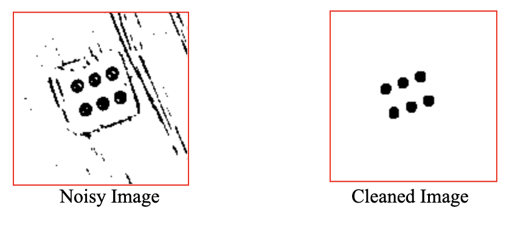

# Module 2
### Box Blur, Gaussian Blur, etc. // Erosion and Dilation

- [Overview](#overview)
- [Lecture Slides](#lecture-slides)
- [Objectives](#objectives)
- [Skeleton Code](#skeleton-code)
- [Helpful Tips and FAQ](#helpful-tips-faq)
- [Checkoff Questions](#checkoff-questions)

## Overview {#overview}

In the second image processing module, we will introduce various methods on improving the quality of images, at least from a computer’s viewpoint. By performing techniques like blurring, erosion, and dilation, we can prepare an image for a blob detection algorithm. After going over the basic conceptual background for these techniques, we will apply them to an image of white dice to remove visual artifacts (or noise).

## Lecture Slides {#lecture-slides}

[Click here for lecture slides](https://docs.google.com/presentation/d/16VabwJj7FgEXsF_ooGWiYEC7AshbvK_XKuDeHOT2990/edit?usp=drive_link)

## Objectives {#objectives}

By the end of Module 2 in the skeleton code, you will have filtered out artifacts in an image, going from this to this				

## Skeleton Code {#skeleton-code}

[Modules 1-3: Dice Detection](https://colab.research.google.com/drive/1enqrfz7Y4wEG6Qgae1qbllJe3fynSznn?usp=sharing)

Note that for Modules 1-3, we will be using the same Jupyter notebook for coding as some modules depend on previous results.

In the Module 2 section of the notebook, you are given more of a free hand in exploring different image processing techniques to improve the usability of an image. By trying blurring, erosion, and dilation in different combinations, you can explore all the different ways to get to an image that will be ready for blob detection in Module 3.

## Helpful Tips/FAQ {#helpful-tips-faq}

[Click here for FAQ sheet](https://docs.google.com/document/u/0/d/1lUnK5WOirf125nsWOR8H8y9OeY6WMU5Oy9NtQBtFl_8/edit)

## Checkoff Questions {#checkoff-questions}

* After eroding and dilating, circular blobs become less circular. Why might this be the case?
* To preserve the size of the image, everytime you erode you must dilate and everytime you dilate, you must erode. How do you know when to do which first?
* Why is blurring helpful? When is it appropriate to blur the image?