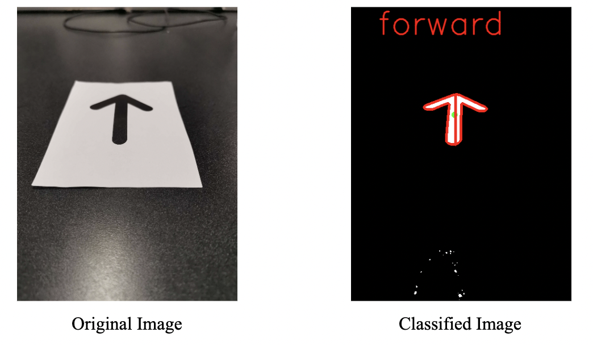

# Module 4

### All About Contours // Reading Arrows

- [Overview](#overview)
- [Lecture Slides](#lecture-slides)
- [Objectives](#objectives)
- [Skeleton Code](#skeleton-code)
- [Helpful Tips/FAQ](#skeleton-code)
- [Checkoff Questions](#checkoff-questions)

## Overview  {#overview}

To continue expanding on what we have done so far, we will introduce contours, OpenCV’s even more flexible shape detection method. There is a brief conceptual overview of what contours are in the lecture slides, but the real meat of this module is the skeleton code. You will be walked through how we can use certain characteristics of a contour, like convexity, moment of inertia, center of mass, and more, to distinguish one from the other. The goal will be to preprocess an image containing a symbolic instruction, like a stop sign or an arrow, and utilize OpenCV’s contour methods to recognize that symbol as stop, forward, right, or left.

## Lecture Slides {#lecture-slides}

[Click here for lecture slides](https://docs.google.com/presentation/d/18HkCl3PE8X0LkocppHsm0W58tI0TzuiOxXtO3bjuQWg/edit?usp=drive_link) 

## 

## Objectives {#objectives}

By the end of Module 4, you will have used a variety of OpenCV’s contour methods to implement a lengthy function to classify an image as a written instruction.

## Skeleton Code {#skeleton-code}

[Module 4: Contours](https://colab.research.google.com/drive/1q5mRnvqbVB1puqR1HxueBTcW1wSKTNmq?usp=sharing)

In this Jupyter notebook, you start with some unprocessed .jpg images of a stop sign and some arranged arrows. Using what you learned from Modules 1-3, and a new floodfill function, you can write a function that isolates the black shape by itself. 

Then, you will write a larger function consisting of conditional statements that distinguish between a contour’s features, like its centroid, convexity, area, and more. These will enable you to tell the difference between stop, forward, right, and left, and we have also provided a function to help you visualize how your classification scheme is working.

## Helpful Tips/FAQ {#helpful-tips-faq}

[Click here for FAQ sheet](https://docs.google.com/document/u/0/d/1lUnK5WOirf125nsWOR8H8y9OeY6WMU5Oy9NtQBtFl_8/edit) 

## Checkoff Questions {#checkoff-questions}

* How would you find the direction your car should travel if, in addition to the signs we already have, we also had a backwards arrow sign?
* What would the hierarchy list look like for a bullseye with three concentric circles? Assume the background is distinct from the bullseye’s outermost circle and there is no “noise” in the image.

* Why must we invert **our** image of the arrows before using OpenCV’s contour functions? (why do we want a black background instead of a white one?)