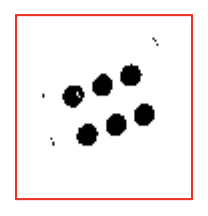

# Module 1
### Downscaling // Grayscaling, HSV Conversion // Thresholding and Adaptive Thresholding

- [Overview](#overview)
- [Lecture Slides](#lecture-slides)
- [Objectives](#objectives)
- [Helpful Tips/FAQ](#helpful-tips-faq)
- [Checkoff Questions](#checkoff-questions)

## Overview {#overview}

Our first image processing module will go over how a computer sees images, how image processing works mathematically, and how we can make images easier for the computer to read and analyze. This module mostly focuses on techniques that simplify the image through color and contrast adjustments. We will learn the benefit of techniques such as downscaling, grayscaling, thresholding and adaptive thresholding.

## Lecture Slides {#lecture-slides}

[Click here for lecture slides](https://docs.google.com/presentation/d/16VabwJj7FgEXsF_ooGWiYEC7AshbvK_XKuDeHOT2990/edit?usp=drive_link)

## Objectives {#objectives}

By the end of Module 1 in the skeleton code, you should have a thresholded grayscale image that looks similar to this: 

## Skeleton Code {#skeleton-code}

[Modules 1-3: Dice Detection](https://colab.research.google.com/drive/1enqrfz7Y4wEG6Qgae1qbllJe3fynSznn?usp=sharing)

Note that for Modules 1-3, we will be using the same Jupyter notebook for coding as some modules depend on previous results.

In the Module 1 section of the notebook, you will be walked through loading an image with OpenCV, displaying that image, converting that image to different color spaces, and applying thresholds across that image.

## Helpful Tips/FAQ {#helpful-tips-faq}

[Click here for FAQ sheet](https://docs.google.com/document/u/0/d/1lUnK5WOirf125nsWOR8H8y9OeY6WMU5Oy9NtQBtFl_8/edit)

## Checkoff Questions {#checkoff-questions}

* What are the advantages of using HSV vs Grayscale?
* Why does your HSV converted image look weird?
* What is the benefit of increasing the Gaussian kernel size when adaptive thresholding?