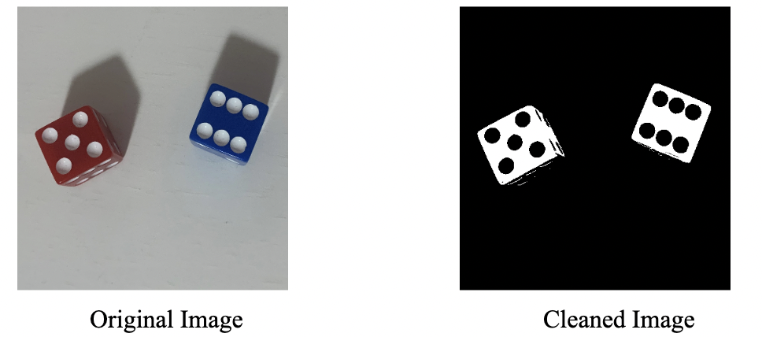
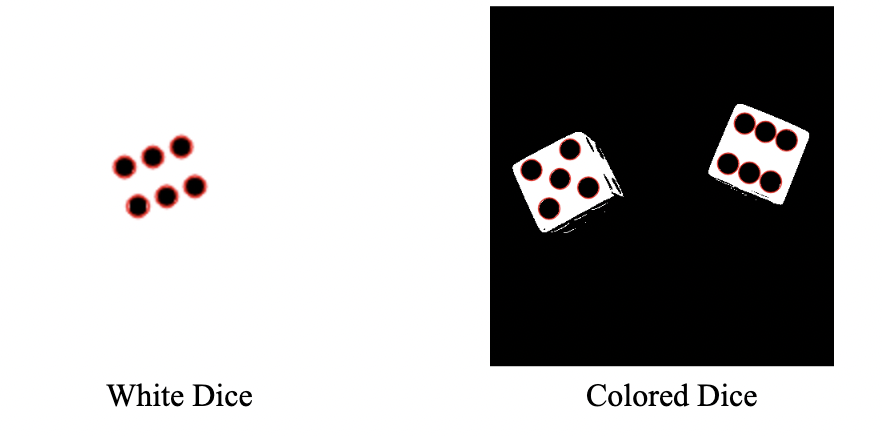

# Module 3

### Masks and Blob Detection

- [Overview](#overview)
- [Lecture Slides](#lecture-slides)
- [Objectives](#objectives)
- [Skeleton Code](#skeleton-code)
- [Helpful Links/FAQ](#helpful-tips-faq)
- [Checkoff Questions](#checkoff-questions)

## Overview {#overview}

In Module 1, we learned how we can use thresholds to have OpenCV “pick out” certain parts of an image based on its pixels’ grayscale values. In general terms, this is creating a mask, which is a purely black and white image used to pick out desired features. In this module, we will learn different ways to create these masks, specifically using HSV values to filter out desired parts of our image.

The second part of this module will make use of OpenCV’s blob detection feature, which allows us to count the number of blobs on the mask. We will also learn OpenCV’s Simple Blob Detector parameters, which allow us to filter blobs based on a variety of attributes like circularity, color, size, etc.

## Lecture Slides {#lecture-slides}

[Click here for lecture slides](https://docs.google.com/presentation/d/1XfI1txHgtaMa7_NAAd37OG5br-U1x2tV51z1D6oa2p8/edit?usp=drive_link)

## Objectives {#objectives}

By the end of Module 3, you will have worked with color dice and HSV filtering, going from this to this.

And finally, you will have counted the number of blobs on both the colored image, and the white dice from Modules 1 and 2.

## Skeleton Code {#skeleton-code}

[Modules 1-3: Dice Detection](https://colab.research.google.com/drive/1enqrfz7Y4wEG6Qgae1qbllJe3fynSznn?usp=sharing)

Note that for Modules 1-3, we will be using the same Jupyter notebook for coding as some modules depend on previous results.

In the Module 3 section of the notebook, you will begin with a new image, that of two colored dice. After using some different techniques, you will arrive at a thresholded image of the dice, called a mask. Finally, after implementation of OpenCV’s simple blob detector, you have a pipeline that takes in an image of a dice and spits out the number of dots, and which pixels they are located at in the image.

## Helpful Tips/FAQ {#helpful-tips-faq}

[Click here for FAQ sheet](https://docs.google.com/document/u/0/d/1lUnK5WOirf125nsWOR8H8y9OeY6WMU5Oy9NtQBtFl_8/edit)

## Checkoff Questions {#checkoff-questions}

- Imagine that a dice was thresholded poorly, and the shadow the dice cast was part of the resulting mask. If your blob detector is counting this shadow, how might you fix this?
- What bitwise function would you use to perform masking? (applying the mask to the original image)
- Why was adaptive thresholding not necessary for HSV filtering? (i.e., why were we able to set static values for the hue)
