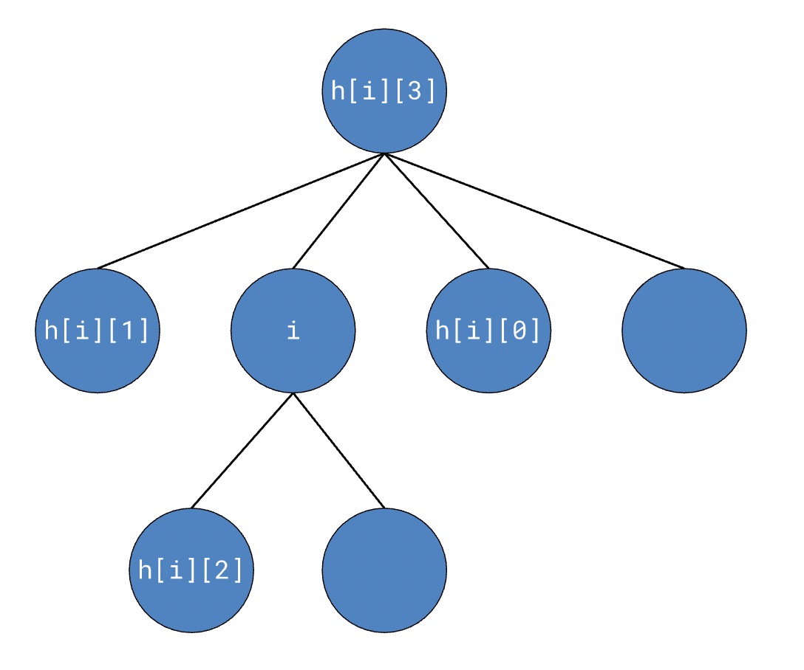

# OpenCV

All instances of referring to a slide number, unless otherwise specified, are referring to the slides from Lecture 2 on Localization.

## Setting up the camera on the Pi

All of our Raspberry Pis come with Python 3 preinstalled. You just need to run these commands:

- **OpenCV**. Install it using Pip by running the following command:

  pip3 install opencv-python

- **Numpy**. You’ll most likely\_ \_need to upgrade your version; this has been an issue on every Pi I tried working with. Run the following command:

        pip install -U numpy

- **Some random other stuff**. The first time you do anything with OpenCV on the Pi, you’ll get an error message about a missing file that you’ve probably never heard of before. It’s a simple fix, just run the following command (all on one line):

  sudo apt-get install libhdf5-dev libhdf5-serial-dev libatlas-base-dev libjasper-dev

- If, after running this command (and entering your password when prompted) OpenCV still doesn’t work, visit this [StackOverflow thread](https://stackoverflow.com/questions/53347759/importerror-libcblas-so-3-cannot-open-shared-object-file-no-such-file-or-dire). They mention a bunch of additional libraries you can try to install and see if that fixes things. The thread is a bit old, so you’ll find that a lot of the libraries they mention don’t exist anymore, but some of them should work.
- **Enable the Camera**. Finally, we need to enable the camera on our Pi. Run:

        sudo raspi-config

`	`And navigate to Interface Options -> Legacy camera using the arrow keys. Press enter and reboot the Pi.

## Downscaling

    new_dims = (int(img.shape[1] * scaleX), int(img.shape[0] * scaleY))
    downscale = cv2.resize(img, new_dims)

Annoyingly, the image `shape` property (which contains the dimensions of the image array) is encoded as `(height, width)`, but the resize function makes you supply a tuple in the form of `(width, height)`. Make sure you get the indices right when multiplying by your scale factors, which should be between 0 and 1.

## Color conversion

    new_img = cv2.cvtColor(img, color_code)

Example Color Codes:

    color_code = cv2.COLOR_BGR2GRAY
    color_code =  cv2.COLOR_BGR2HSV
    color_code = cv2.COLOR_BGR2HSV_FULL

For the full list of color codes, see [this page](https://docs.opencv.org/3.4/d8/d01/group__imgproc__color__conversions.html). There are a _lot_ of color conversion formats here, but for grayscaling you’ll use `cv2.COLOR_BGR2GRAY` and for HSV you’ll use `cv2.COLOR_BGR2HSV` or `cv2.COLOR_BGR2HSV_FULL`. Note that OpenCV encodes your images by default as BGR (blue-green-red) and not RGB, so you have to use the appropriate conversions.

## Box Blur

    <code><em>blur = cv2.blur(img,(n,m))</em></code>

`(n,m)` is the size of your blurring kernel. For example, `(3, 3)` would indicate that each pixel is getting replaced with the average of the 3x3 box around it – a small amount of blurring. Something like `(13, 13)`, on the other hand, would blur each pixel with a 13x13 box of pixels around it, which is much more significant. However, they don’t have to be equal – if you really wanted to, you could do a rectangular blurring kernel. Try things and see what they do!

## Gaussian Blur

    <code>blur = cv2.GaussianBlur(img,ksize=(k,k),sigmaX=0)</code>

Here, ksize is the side length of our kernel (must be odd). Sigma X is the standard deviation in the X direction and if set to 0 is automatically calculated from ksize (sigmaY defaults to the same as sigmaX) For more details, visit [this page](https://docs.opencv.org/4.x/d4/d86/group__imgproc__filter.html#gaabe8c836e97159a9193fb0b11ac52cf1). For the functional difference between box blurring and Gaussian blurring, see slide 23.

For additional blurring techniques, visit [this page](https://docs.opencv.org/4.x/d4/d13/tutorial_py_filtering.html).

## Simple thresholding

    _, new_img = cv2.threshold(src, thresh, maxval, type)
    type = cv2.THRESH_BINARY_INV or cv2.THRESH_BINARY

This is done on a grayscale image. When the thresholding type is set to `cv2.THRESH_BINARY`, it sets all pixels above `thresh` to `maxval` and all pixels below it to 0. When it’s set to `cv2.THRESH_BINARY_INV`, the function sets all pixels above `thresh` to 0 and all pixels below it to 255.

## Adaptive thresholding

    mask = cv2.adaptiveThreshold(im, maxValue=255,
    adaptiveMethod=cv2.ADAPTIVE_THRESH_GAUSSIAN_C, thresholdType=cv2.THRESH_BINARY_INV, blockSize=k, C=t)

This function implements adaptive thresholding; the values you will be playing with should be `blockSize` and `C` (maybe also the adaptive method). C is a constant that is **subtracted** from the adaptive threshold.

For all the different types of thresholding in OpenCV, visit [this page](https://docs.opencv.org/4.x/d7/d4d/tutorial_py_thresholding.html).

Note: There’s been some confusion about how the C value works exactly. Basically, the adaptive thresholding function operates on every pixel in the original image as follows:

1. Calculate a threshold by taking the Gaussian mean of the values in a `k`-by-`k` block centered on the pixel in question.
2. Subtract this value by C.
3. Compare the resulting threshold value with the value of the pixel and act in accordance with `thresholdType`.

## Thresholding with HSV

**Important note**: the range of hues in OpenCV is **0 to 180**, not 0 to 255. Using values above 180, to the best of our knowledge, don’t really do anything.

    <code><em>mask = cv2.inRange(hsv, lowerBound, upperBound)</em></code>

The traditional threshold functions don’t really work for HSV images, so we use the `cv2.inRange()` function instead. Here, lowerBound and upperBound are three-tuples. A range of, for example,

    cv2.inRange(hsv, (135, 0, 0), (180, 255, 255))

would create a mask preserving only those pixels that fall between the hue range of 135-180; in other words, purple to red. Since the saturation and value ranges are 0-255, pixels of any saturation and value will be preserved in the mask. When you display a mask using `cv2.imshow()`, it’ll give you an image that’s white at all the pixels that meet the range criteria and black everywhere else. Refer to slide 38 in the lecture for an example.

## Bitwise mask operations

    <code><em>mask = np.bitwise_and(x1, x2) \
    mask = np.bitwise_or(x1, x2)</em></code>

    mask = np.bitwise_not(x1, x2)
    result = cv2.bitwise_and(x1, x1, mask=x2)

These work about as you’d expect them to, except instead of operating on two bits they operate on two arrays of bits. See slide 39 for a visual explanation of their functions.

You’ll note that the syntax for the operation combining a mask with an image is slightly different from the operations on just masks themselves. This is because in Python and OpenCV, your image will typically be represented as an array of 3 “channels”, for R-G-B or H-S-V. However, you can’t combine a 3-channel image with a 1-channel mask (because it’s just black and white) using Numpy, so you have to use the OpenCV function instead.

## Erosion and Dilation

    res = cv2.erode(img, np.ones((k,k), np.uint8), iterations=n)
    res = cv2.dilate(img, np.ones((k,k), np.uint8), iterations=n)

Like with previous functions, `(k,k)` is the block size. `n` is a whole number representing the number of times you want your erosion or dilation to be applied to the image.

## Floodfill

    h, w = img.shape[:2]
    mask = np.zeros((h + 2, w + 2), np.uint8)
    cv2.floodFill(img, mask, (j, k), color)

Floodfill is an algorithm that essentially starts at a certain point and “spreads out” to all the adjacent points in the image that are equal to it. You can think of it as doing the exact same thing that the Fill Bucket tool does in computer drawing programs.

Here, the floodfill function modifies the `img` parameter directly – in other words, it **does not return a new image.** The `mask` parameter will in almost all cases be a slightly bigger but empty image; in practice, nonzero values in the mask specify “walls” that the floodfill algorithm can’t cross. Finally, `(j,k)` is the starting point (the function will fill whatever _closed_ region contains that point) and `color` is the color value (from 0-255) that you want to fill the region with.

Note that in the starting point `(j,k)`, `j` represents the column and `k` represents the row – like an XY-coordinate pair starting at the top left of the image and growing downwards.

## Simple Blob Detection

    bdp = cv2.SimpleBlobDetector_Params()
    bdp.filterByArea = False
    bdp.filterByConvexity = False
    bdp.filterByCircularity = True
    bdp.filterByInertia = False
    bdp.filterByColor = True
    bdp.blobColor = 255
    bdp.minCircularity = 0.5
    bdp.maxCircularity = 1
    detector = cv2.SimpleBlobDetector_create(bdp)
    points = detector.detect(mask)

The above code extracts all white blobs with a circularity greater than 0.5. You can read more about the different features [here](https://docs.opencv.org/3.4/d0/d7a/classcv_1_1SimpleBlobDetector.html).

The list of all available parameters for the blob detector can be found [here](https://docs.opencv.org/3.4/d8/da7/structcv_1_1SimpleBlobDetector_1_1Params.html) (and the ones we use are listed below). To add one of the above filters, set it to `True` instead of `False` as shown above, and then update the relevant minimum and maximum parameters. The documentation is for C++, but the names should be the same (and they’re listed below); and if a certain parameter doesn’t work, a little Googling goes a long way :-)

So far, we’ve used the following <code>SimpleBlobDetector_Params<em></em></code> members:

- `bool 	filterByArea`
- `float 	minArea`
- `float 	maxArea `
- `bool 	filterByCircularity`
- `float 	minCircularity`
- `float 	maxCircularity`
- `bool 	filterByInertia`
- `float 	minInertiaRatio`
- `float 	maxInertiaRatio`
- `bool 	filterByColor`
- `int		blobColor`
- `bool 	filterByConvexity`
- `float 	minConvexity`
- `float 	maxConvexity`

## Finding contours

    contours, hierarchy = cv2.findContours(img, cv2.RETR_TREE, cv2.CHAIN_APPROX_SIMPLE)

`contours` is a list of all the contours in the image.

`hierarchy` is a 2D array containing hierarchical information about each contour. In the following diagram, <code><em>i</em></code> is the index of a given contour in the list <code>contours</code>. <code>hierarchy</code> is actually an array containing the tree of contours, so the data we’re actually concerned with is in <code>hierarchy[0]</code>. The <code>i</code>-th element in the tree is an array of 4 elements: the next sibling, previous sibling, first child, and parent, respectively. If any of these elements don’t exist (for example, the parent of the root contour or any node with no siblings), it’ll be <code>-1</code> in the array.

## Contour area

    area = cv2.contourArea(contours[i])

This function returns the area of the contour, in pixels. `contours[i]`, of course, is the _i_-th contour in the list of contours.

## Contour convex hull

    hull = cv2.convexHull(contours[i])

Remember that the convex hull of a blob is a purely convex polygon that encloses a contour. To find the convexity of a contour, you calculate the ratio of the area of the contour to the area of its convex hull.

## Contour bounding rectangle

    x,y,w,h = cv2.boundingRect(contours[i])

The regularly-oriented bounding rectangle of a contour isn’t as “tightly wrapped” as the convex hull, so to speak. Typically the formula for calculating a bounding rectangle involves finding the leftmost and rightmost x-coordinates in the blob, finding the topmost and bottommost y-coordinates, and creating a rectangle using those coordinates to determine:

`x` – the _x_-coordinate of the top-left corner of the rectangle

`y` – the _y_-coordinate of the top-left corner of the rectangle

`w` – the width of the rectangle

`h` – the height of the rectangle

This will typically result in the bounding rectangle having more excess area than the convex hull of a given contour.

## Contour moment of inertia

    moments = cv2.moments(contours[i])
    mx = int(moments["m10"] / moments["m00"])
    my = int(moments["m01"] / moments["m00"])

The `cv2.moments` function actually returns some more complicated data than what we’ll have to use, but these are the formulas for calculating our needed coordinates. `mx` and `my` are the x and y-coordinates of the moment of inertia of the contour at `contours[i]`.

**Note: **sometimes, you’ll get a DivideByZero error from either of these lines in your code. The issue here is that, if your contours don’t separate properly, the value `moments["m00"]` will be zero and your division will cause an error. To fix this, you can simply wrap these calculations in a `try/except` block, handling the error as you see fit.

The guide [here](https://docs.opencv.org/3.4/dd/d49/tutorial_py_contour_features.html) has additional functions that you can use with contours. As we use more, we’ll add them to these docs.
