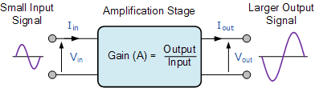
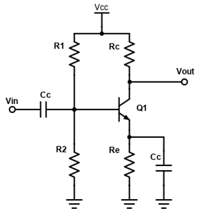
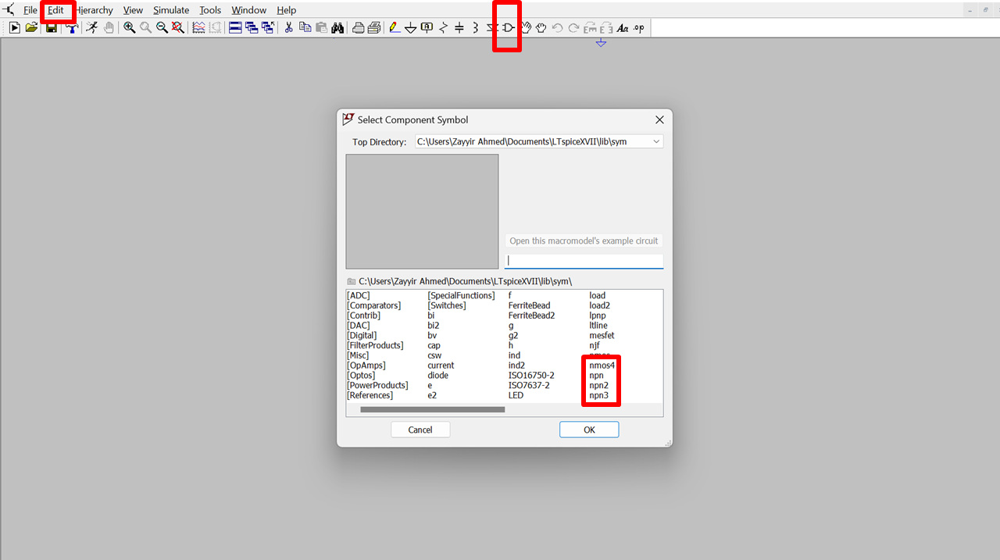
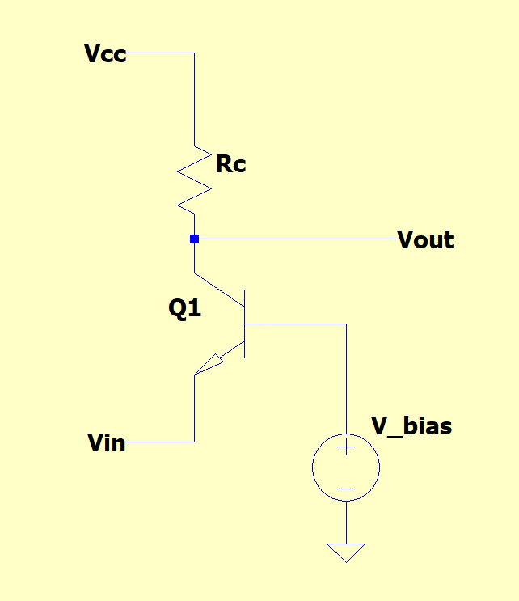

# Module 1

### Introduction to Amplifiers and LTspice

**<ins>Lecture Notes:</ins>**

[Lecture 1 Notes](https://drive.google.com/file/d/1UlqseA_aiCYNR1isKwwh8ZNgZEOqVJPT/view?usp=sharing)

**<ins>Motivation:</ins>**

In this module, we will cover the basics of using LTspice to verify our circuit designs. We will verify parameters such as gain, input impedance and output impedance using different types of analysis including transient and AC analysis. Throughout this process, we will also review the content covered in the lecture 1 notes by creating a Class A amplifier from a given spec and deriving component values to meet the performance requirements using BJT amplifier basics. We will then briefly touch on another type of amplifier structure and its pros and cons.

**<ins>Prerequisites:</ins>**

General understanding of continuous signals and systems

Circuit Theory 1 and 2 (KCL, KVL, super-position, linearity, linear circuit elements, frequency response, power, impedance)

**<ins>Skills Learned:</ins>**

LTspice circuit design

Class A amplifier design

Common-Base Amplifier design

Designing for input and output impedance

**<ins>Parts List:</ins>**

LTspice

**<ins>Setup:</ins>**

Time to get set up! Please install LTSpice from Analog Devices: https://www.analog.com/en/design-center/design-tools-and-calculators/ltspice-simulator.html

A prior WRAP lead and WRAP creator, David Baum, recorded a [fantastic video](https://www.youtube.com/watch?v=OwtuRsOh_rc) that will give you a quick rundown of how to use LTSpice. You can find similar such resources on the internet or come to the lab for any questions about using this software.

## Part 1: Common Emitter (Class A Amplifier)

We will start off by using what we have learned in lecture to try creating an amplifier with the following specifications:

Collector current Ic = 1mA

Gain = -40 (16 dB) (At least -40)

Collector-emitter voltage Vce = 2.5V

Supply voltage Vcc = 5V

Use the MMBTH10 transistor (this is the transistor we will be using later in the project as well)

To verify our design we will be using LTspice, a widely used circuit simulation tool. LTspice allows us to select different components and place them together in a network, or netlist to create a system.

For devices like transistors and diodes which can have vastly different performances and specifications, LTspice allows us to input specific parameters that characterize the performance of the device. The transistor we use is not provided for LTspice, so we will have to import its parameters. To make sure LTSpice knows what numbers to use to model its behavior you will need to add a Spice directive, with the following text:

    ****

    .model MMBTH10 npn

    + IS=69.28e-18    XTI=3             EG=1.11           VAF=100

    + BF=308.6        NE=1.197          ISE=69.28e-18     IKF=22.83e-3

    + XTB=1.5         BR=1.11           NC=2              IKR=0

    + RC=4            CJC=1.042e-12     MJC=0.2468        VJC=0.75

    + FC=0.5          CJE=1.52e-12      MJE=0.3223        VJE=0.75

    + TR=1.558e-9     TF=135.8e-12      ITF=0.27          VTF=10

    + XTF=30          RB=10

    ****

Please copy and paste this exactly (only what is within the asterisks, not including them).

Once LTspice has installed, open it and create ‘New Schematic’. To add the transistor model above, please right click in the middle of the screen click ‘Draft’ -> ‘SPICE Directive’. Alternatively, you may press ‘S’ to access the SPICE Directive Menu. Copy and paste the above code into the text box, and click ‘OK’. Then left-click to place it where you want.

We’ve now instructed LTspice how our device can be modeled - but we do not yet know how to construct it. To add the component after creating the directive, navigate to ‘Edit’ and click on ‘Component’ (alternatively, F2) then add component npn. Ctrl+right click and change ‘Value’ to npn to MMBTH10, or alternatively, right-click on the “npn” text under Q1 and change it to “MMBTH10”.

Your npn transistor should now look like the above.

**<ins>Checkpoint 1: DC Biasing</ins>**

Alright, with that done we can now set up a stable DC bias (that is, set the desired collector current). Recall from Lecture 1 that in order to properly bias the common emitter amplifier, we need to add a resistor at the emitter, Re. Recall that the collector current will end up being Ve/Re (emitter voltage divided by emitter resistor) and that we have Vcc=5V to play with.

Note that because we want a fixed collector current of 1 mA, If we make Re too large, since IC ~ IE, then we will have too large of a voltage drop from emitter to ground, leading to the transistor being in the saturation region (recall that we want the collector voltage to be larger than the base voltage to operate in the linear region and our base voltage to be around one forward voltage drop larger than our emitter, hence a larger emitter voltage requires a larger base and therefore collector voltage, but our collector voltage cannot exceed 5 V at which point IC ~ 0 A which we do not want). And if Re is too small, we do not have good bias point stability against beta and temperature variations. Try playing around with values to see how changing Re affects bias.

We also need to select the proper Rc value. We know the gain must be -40, and gain is given by -gm\*Rc. Since we know the desired collector current, we can compute gm and determine the proper value of Rc. With Rc known, we can figure out what voltage we need across Re in order to set Vce=2.5V (one of the specs). From there, we can find the proper value of Re.

Lastly, we set R1 and R2, the base voltage divider resistors, in order to obtain the proper voltage at the base. Since we know what the voltage at the emitter should be from the previous step, we can calculate what the base voltage should be. That is, the base voltage is the emitter voltage plus Vbe, the voltage from base to emitter).

By the end of this step, you should be able to report the values

- R1
- R2
- Rc
- Re
- Ve, the voltage at the emitter
- Vc, the voltage at the collector
- Vb, the voltage at the base

**<ins>Checkpoint 2: Measuring Small-Signal Gain</ins>**

Once you have your DC bias set up, it’s time to attach an AC source signal and measure the output voltage. Use a large resistor as the load of the amplifier (100k works well). Take a moment to think about why we want R_L to be this large - how does a smaller load affect our gain? Also, be sure to include the AC coupling capacitors on both the input and output, as well as the bypass capacitor at the emitter (what capacitance should you use?).

Use an input frequency of 10 kHz and an input amplitude of 1mV (again, think about the idea of ‘small signal’ compared to the bias point at the base). Since the gain is -40, the output should be 180° out of phase (with respect to the input) and 40 times larger. Verify that with a transient simulation. Try removing the bypass capacitor at the emitter. What happens to the gain (at the risk of being repetitive, think about why)?

By the end of this step, you should have:

- A functional CE amplifier with bypassed emitter degeneration
- Comfort with DC and transient analysis in LTSpice

**<ins>Checkpoint 3: Input and Output Impedance</ins>**

Now, let’s measure the input and output impedance of the amplifier at 10 kHz. Set an AC amplitude of 1 to the input voltage source (as shown in the tutorial video) and set up an AC simulation. Plot the input impedance of the amplifier versus frequency. Now move the input voltage source to the output, replacing the load resistor. Find the output impedance, and save a screenshot.The output resistance should be fairly close to Rc. See how your measurements compare to the theoretical formulae we discussed in the lecture.

By the end of this step, you should have:

- The input impedance at 10kHz (and the impedance over frequency)
- The output impedance at 10kHz (and the impedance over frequency)

## Part 2: Common Base Amplifier

Above is the circuit of another type of amplifier known as common base; note that unlike the common emitter configuration shown above, it does NOT invert our signal.

- Use the small signal model of npn transistor to prove the gain of this amplifier is Av= gm\*Rc
- Conceptually explain why the gain of this amplifier is positive while for the common emitter the gain is negative (you can verbally explain it once you come to us for checking your assignment). Hint: consider small voltage changes at the emitter and how those changes manifest themselves at the other terminals of the BJT. You may also approach this question from a semiconductor physics perspective - but it is much easier to consider larger scale phenomena such as voltage and current.
- What do you think is one disadvantage of this amplifier over the common emitter configuration? Hint: Consider the attributes of the common-emitter stage shown above - its gain, phase, input and output impedance, etc.
- As motivation for the next part of WRAP, start to think about why we wanted a large load impedance when we made our Class A amplifier in LTspice. If possible, try adding another RL to the VOUT of the diagram below and see how that affects the gain and if this effect of “loading” the output with an impedance is universal.
