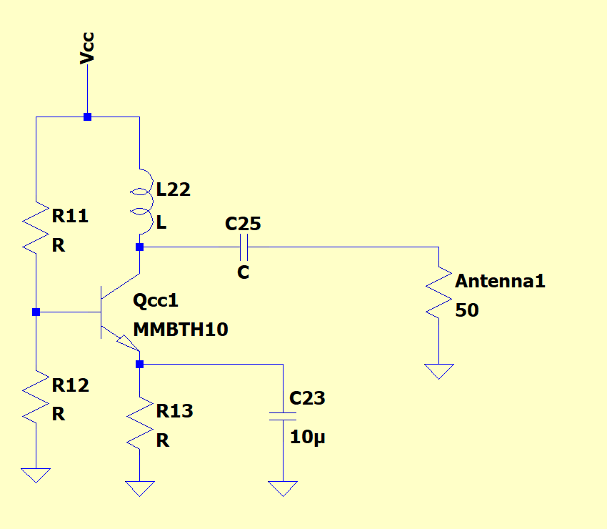

# Module 4

### Designing the System!

**<ins>Lecture Notes:</ins>**

[Lecture 4 Notes](https://drive.google.com/file/d/1z5X1Weqe-dtoa9pqKqrgqOpMpCW0C3lA/view?usp=sharing)

**<ins>Motivation:</ins>**

We’ve thus far covered ways of amplifying signals and generating frequencies - but is there a way to generate frequencies given other frequencies? From last time, we saw that using feedback, we can create systems whose output oscillates at a designed frequency. One common use of generating known, stable frequencies is in use of the Local Oscillator or LO of a mixer, whose operation is covered in the Lecture 3 notes.

This is also why we wanted to ensure that our signal generated by our Colpitts Oscillator had a high enough power level - our LO needs to be large enough in power that it can sustain a voltage drop of 0.6 to 0.7 V - enough to maintain forward operation of the diodes in the diode ring mixer.

**<ins>Prerequisites:</ins>**

Lecture 1, 2 and 3. alongside assignment 1, 2 and 3.

Signals and Systems

Impedance across Frequency

Power Transfer characteristics

Class A Amplifiers

Transmission Line Theory

LTspice

**<ins>Skills Learned:</ins>**

System level RF design

Impedance Matching (T-Attenuator, LC matching network)

Smith Charts

LC tank Common Emitter Amplifier

**<ins>Parts List:</ins>**

LTspice

Smith Chart

**<ins>Setup:</ins>**

We have finally designed all necessary components. All you have to do is put it together! This assignment introduces you to some techniques which will help you a lot during your milestone design.

## Part 1: T-Attenuator

To ensure maximum power transfer, your impedance between modules should be matched! Your filters have an input and output impedance of 50 and the antenna is also 50. All these modules need to be matched.

It is best to design your modules such that they already match impedances, but oftentimes, that can be difficult such as in mixers. In this part, you will be matching your first mixer (1MHz to 5 MHZ) to the first stage buffer:

- Using transient analysis, measure the input impedance of your mixer at its IF port. To do so, connect a voltage source (1MHz sine wave with 1V amplitude) to the port and measure the peak current. Dividing the peak voltage of 1V by the peak current will give you the real part of the impedance. The phase difference between the current and voltage gives the imaginary part of the impedance but we don’t have to worry about that for now. Make sure your 4MHz oscillator is also connected to the LO port. You can model the filter at the RF port by either using the filter from assignment 3 terminated by 50 ohms (recommended) or simply connecting a 50 ohm resistor to the RF.
- Measure the output impedance of the first stage buffer using AC analysis as before.
- Use [Matching T Attenuator Calculator (chemandy.com)](https://chemandy.com/calculators/matching-t-attenuator-calculator.htm) to match the buffer to the mixer. Once you have inserted the T attenuator between the buffer and the mixer, plot the FFT at the output of the buffer. Go back to the online tool and play around with the attenuation factor until you find the smallest value which gives at least -35dB difference between the 1MHz peak and the rest of the peaks on the FFT.

**<ins>Checkpoint 1:</ins>**

Show the voltage at the output of the buffer and its frequency spectrum.

Show the voltage and FFT at the RF port of the mixer with the 50 ohm load connected.

## Part 2: Impedance Matching with Lumped Elements (L - Networks)

At the final stage for the transmitter, we want to amplify the 27.185MHz signal and feed it into a 50 ohm antenna. The low impedance that the antenna presents significantly reduces the gain of your amplifier. Therefore, we have to add a network before the antenna so that looking into it, we see a higher impedance that is equal to the output impedance of the amplifier. We won’t ask you to use the smith chart (even though you should know how to use it as an RF engineer). For this part of the assignment you are not allowed to use a buffer.

- Create a sinusoidal voltage source with 1mV amplitude and 27.185MHz frequency.
- Design an amplifier stage with a gain of 500 so that the output with no loads connected is 500mV amplitude. This is not a trivial stage. You will probably have to cascade two common emitter amplifiers to achieve this gain.
- Measure the output impedance of this stage using AC analysis technique.
- Now connect your amplifier to a 50 ohm resistor (antenna) and measure the peak to peak voltage. Don’t forget the decoupling capacitor (100nF is a good choice for this stage).
- Next, go to [RF Impedance Matching Calculator](https://www.analog.com/en/design-center/interactive-design-tools/rf-impedance-matching-calculator.html) to create an impedance transformer. For the characteristic impedance box, enter the output impedance of your amplifier stage. The website generates two networks for you. Choose the one with reasonable values and add it in between your amplifier and antenna. Run the simulation again and measure the peak to peak voltage. You should notice an improvement in your output level.

**<ins>Checkpoint 2:</ins>**

Show the output voltage plots at the antenna with and without the impedance matching network.

## Part 3: Common Emitter with LC Resonator

We will finish this assignment with the last trick of the trade we learned in fall.

Choose a capacitor value which gives you a Qs of at least 3 at 27Mhz (remember Rs is the antenna impedance which is 50). This capacitor should be in the order of pF. Next, calculate an inductor value which has the same reactance as the capacitor at 27Mhz.

Replace the collector resistor of your amplifier with the inductor and place the capacitor between the output and the antenna (see the picture below). This capacitor acts as a decoupling capacitor as well.

Run the transient simulation and measure the output voltage at the antenna.

**<ins>Checkpoint 3: </ins>**

Show the output voltage plot at the antenna along with its FFT.

## Part 4: Putting it all together

You are now familiar with the fundamental hardware blocks of an RF communication system i.e.:

Amplifier, buffer, oscillator, mixer, filter, attenuator, LC-network

As our fall quarter milestone, you will design a transmitter and a receiver in LTspice. Feel free to use the architecture discussed in the lecture. However, as designers, you have complete control over how you design your hardware as long as you meet the specifications. For example, you can try another oscillator design, but you have to prove it works both theoretically and in simulation.

Summary of Specifications:

Distance to transmit: 100m

Received Power: 1uW

Target Frequency: 27.185 MHz

Frequencies must be within 27.01-27.36 MHz (Pass band)

Transmitted Power: 5mW

First, let’s derive our specifications. The first two are given specifications. Don’t worry, you don’t have to calculate anything for this part, but we do encourage you to go through this to understand the justification behind our specs.

Target Frequency:

The FCC allocates certain frequencies for different purposes/groups. As civilians in a hobby project, our device must reside within the 26.96-27.41 MHz frequency band. Staying within your allocated frequency is very important! Hence, we will aim to transmit a signal in the middle of the band. Target Frequency: 27.185 MHz. Furthermore, a margin is often set so you don’t accidentally project outside this band. We will set our bandwidth as 350 kHz (±175 kHz from target).

Transmitted Power:

A received power of about 1uW is acceptable. With this, we can calculate the needed power for transmission over 100m using the Friis Transmission Equation.

Pr = Power Received in dBm = 10log(1uW) = -60dB

Pt = Power Transmitted in dBm

Gr = Gain of Transmitted Antenna in dBi = 2.15 dBi

Gt = Gain of Received Antenna in dBi = 2.15 dBi

= Wavelength = 11.11 m @27MHz

d = distance = 100m

Solving the Friis Equation with the given quantities, the transmitted power is -22.8dB or ~5mW.

Transmitter:

Input: the input to the transmitter comes from STM32 microcontroller. Model the input signal as a 1MHz sinusoid with 1.65V amplitude and a DC offset of 1.65V (this should create a sine wave that oscillates between 0 and 3.3V which is the operating range of the microcontroller output). You can assume the output impedance of the microcontroller to be 15Kohm.

Output: Transmitted power = 5mW which corresponds to a peak to peak voltage of 1V on a 50 ohm antenna. Your signal should be a sine wave at 27.185MHz.

Receiver:

Input: the received power is 1uW which corresponds to a peak to peak voltage of 20mV on a 50 ohm antenna. For simplicity, assume the input is at 27.185Mhz.

Output: The final signal will be fed into another STM32. This signal should be a 1MHz sinusoid centered at 1.65V and an amplitude as close to 1.65V as possible (3.3V peak to peak). The input impedance of the microcontroller is 1Kohm.
